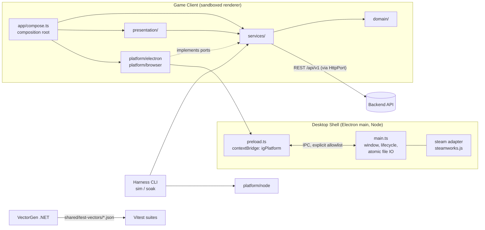

# Refactor: Unity Client → Phaser 4 — Architecture

## Status

Fast-path spine for [PRD.md](./PRD.md). It is a consistency contract for the new client:
it fixes the invariants that keep independently built modules from diverging, and it
seeds the starting structure. Once code exists, the code owns the structure.
`[ASSUMPTION]` marks anything inferred rather than confirmed.

**Confirmed with the user in this phase:**

- `Client/` monorepo folder, sitting next to `Backend/`.
- GitHub Actions for CI.
- Electron 44 + a project-owned steamworks.js fork as the default shell (AD-3/AD-13).
- Crafting's affix roll is server-side only; P7 waits for a backend crafting endpoint
  delivered as a separate game-PRD change (AD-22).
- The menu UI gate (RFR-48) is decided by measured thresholds, not by judgment.
- Vector tolerances are `exact` by default, per the PRD RFR-21 table.
- Content reaches `compose()` through a `ContentSource` port (AD-8).
- Steam Cloud: write after every sync and on quit, compare on every boot (AD-20).
- RNFR-3/4 provisional thresholds are active from G0.
- Animated art comes from Aseprite + CLI export. The existing PNG sheets are wrapped once
  in Aseprite-format JSON.
- Preact + signals for DOM menus, if the RFR-48 gate approves the hybrid UI.
- An own Steam App ID with microtransaction sandbox access exists.

**This document supersedes, for the client only,** these decisions of the parent
[`../infinity-grove/ARCHITECTURE.md`](../infinity-grove/ARCHITECTURE.md):

- AD-1 (VContainer) → replaced by AD-1/AD-4 here.
- AD-4/AD-5 client side (Facepunch) → replaced by AD-13 here.
- AD-7 library → replaced by AD-7 here.
- AD-9 storage location → replaced by AD-12 here.

Parent AD-2/3, AD-6, AD-8–AD-15 remain binding, unchanged.

**Facts read from the repo that shaped decisions:**

- The backend's Swashbuckle OpenAPI is served only in Development.
- `IngestEventRequest.Payload` is an untyped `JsonElement`.
- `Steamworks:WebApiBaseUrl` is configurable.
- The backend Domain implements only BreakInfinity, `CardFusionCostCurve` and event
  validation.
- Of the Unity Domain files, only `MonsterEntity.cs` imports `UnityEngine`.
- Unity `CraftingService` rolls affixes locally.
- No `.aseprite` sources exist.

## Componentes

- Game Client (Phaser 4 + TypeScript renderer bundle; runs in a browser for dev/test and inside the Desktop Shell for release)
- Desktop Shell (Electron main + preload bridge + Steam adapter; the shipped Windows/SteamOS package)
- Verification Harness CLI (Node: `sim`, `soak`, `validate:content`, generators)
- Test-Vector Generator (.NET console tool under `Backend/tools/`)
- Backend API Service (existing, unchanged; consumed over `/api/v1`)

## System shape



## Seed: repository layout `[seed — the code owns this after scaffold]`

```
/Backend/                       existing; + tools/InfinityGrove.VectorGen/, + Domain/Shared/BreakInfinity.cs
/shared/openapi/openapi.json    exported from backend, checked in
/shared/test-vectors/*.json     generated, checked in
/Client/
  src/domain/                   pure rules + entities (1:1 port of Scripts/Game/Domain + Data shapes)
  src/services/                 orchestration, state store, ports (interfaces), event log, sync
  src/presentation/             Phaser scenes, views/screens, input router, theme, (ui-dom/ if hybrid)
  src/platform/{browser,electron,node}/   port implementations
  src/app/                      compose.ts, config.ts, boot.ts, dev-hooks.ts
  src/generated/                assets.gen.ts, api/  (never hand-edited)
  desktop/{main,preload}/       Electron process code
  content/<kind>/*.json         heroes, monsters, stages, equipment, affixes, animations
  assets/                       runtime PNG/atlas/audio/fonts;  art-src/*.aseprite
  tools/                        sim.ts, soak.ts, validate-content.ts, gen-*.ts, art-*.ts
  fixtures/saves/*.json         RFR-14 library;  scenarios/*.json  sim scripts
  tests/{unit,vectors,sim,e2e,shell}/
  steam/                        app_build + depot .vdf files
  PORT_MAP.md
```

## AD-N Decisions

### AD-1 — Paradigm: functional core, ports-and-adapters shell, four layers with one-way dependencies
- **Decision:** `domain/` is a pure functional core. It has no I/O, no time, no randomness
  except through arguments. `services/` is the application layer. It owns state, defines
  every port (interface) for I/O, and orchestrates domain calls. `presentation/` renders
  and translates input into service commands. `platform/` and `desktop/` implement ports.
  The allowed imports are:
  - `domain` → `domain` and `break_infinity.js` (via AD-7 only);
  - `services` → `domain`, `zod` (content and payload schemas, AD-8/AD-11),
    `src/generated/**` (API types and asset manifest, AD-9/AD-10) and `openapi-fetch`
    (only inside `services/backend/`, AD-10). Nothing else;
  - `presentation` → `services`, `domain` (types and pure formatters only, see F5),
    `src/generated/assets.gen.ts`, `phaser`, `preact`, `@preact/signals`;
  - `platform` → `services` ports;
  - `app/` → everything.

  This list is the exact allowlist the `dependency-cruiser` config encodes. Adding an
  entry means amending this AD (and AD-3 for a new package).
- **Reason:** It mirrors the Unity Data/Domain/Service/Presentation split, so the port stays
  1:1. It makes everything below `presentation/` runnable headless (sim, soak, vectors).
- **Trade-off:** Interface ceremony for every I/O touchpoint, even trivial ones.
- **Impact:** Enforced by `dependency-cruiser` rules in `npm run lint`, plus negative
  fixtures (RFR-5). A new module that needs I/O defines a port in `services/` first.

### AD-2 — Monorepo layout; backend owns `BreakInfinity.cs`; `shared/` holds cross-language contracts
- **Decision:** The client lives in `Client/` as a single npm package with no workspaces.
  `BreakInfinity.cs` moves to `Backend/src/InfinityGrove.Backend.Domain/Shared/` as a real
  file, and the `<Compile Include>` link to the Unity tree is deleted. That move is the
  first merged change (RFR-18). Contracts consumed by both languages live in `shared/`:
  `openapi/` (backend → client) and `test-vectors/` (backend tool → client tests). Nothing
  in `Client/` reads from `Backend/` directly, and vice versa, except the generators named
  in AD-10 and AD-18.
- **Reason:** One clone runs the RFR-29 end-to-end test and both generators. The C# client
  is gone, so a neutral `shared/dotnet/` would have one consumer.
- **Trade-off:** The client and backend version together. Splitting repos later means
  publishing `shared/`.
- **Impact:** CI's backend job asserts `dotnet build` with `InfinityGrove/` deleted (RFR-18
  AC) from G0 onward.

### AD-3 — Stack (majors fixed here; exact versions pinned in the lockfile at scaffold)
- **Decision:**
  - Node 24 LTS (`engines` + `.nvmrc`)
  - TypeScript strict, ESM
  - Vite (renderer bundle + dev server)
  - **Phaser 4.2.x** (current stable as of 2026-07, v4.2.1)
  - Vitest (unit/vectors/sim)
  - Playwright (e2e on Chromium + `_electron` shell smoke)
  - zod (content and payload schemas)
  - `break_infinity.js`
  - Preact + `@preact/signals` (only under the AD-15 hybrid outcome)
  - **Electron 44.x** (current stable major as of 2026-09) + electron-builder. A
    different major is an amendment to this AD.
  - **Steam binding: project-owned fork of steamworks.js** in `Client/vendor/steamworks.js/`
    (Rust/napi-rs), pinned to an upstream commit recorded in the fork's README. The
    fork adds two things upstream lacks: `GetAuthTicketForWebApi` (RFR-31 criterion 1)
    and a stable `MicroTxnAuthorizationResponse_t` callback (criterion 4). Prebuilt
    binaries for win-x64 and linux-x64 are produced by an npm script and checked in.
    Upstream steamworks.js is the fallback only if the fork cannot be built.
  - `openapi-typescript` + `openapi-fetch`
  - ESLint + dependency-cruiser
  - `tsx` for CLI tools
- **Reason:** These are mainstream, terminal-driven tools with strong agent familiarity.
  Phaser 4 skills already exist in this environment.
- **Trade-off:** Phaser 4 is a young major version. Owning a native-binding fork means
  rebuilding it on Electron major upgrades and Steamworks SDK updates. AD-13's single
  adapter keeps that cost local.
- **Impact:** Adding a runtime dependency to `domain/` or `services/` requires amending this
  AD.

### AD-4 — Composition root in code; constructor injection; no container, no globals
- **Decision:** `app/compose.ts` exports `compose(config: AppConfig, platform: PlatformPorts): AppContext`,
  which constructs every service once. Phaser scenes and screen controllers are instantiated
  by the app with `new XScene(ctx)` and registered via `game.scene.add`. They never read
  services from `this.registry`, module singletons or `window`. `AppConfig` selects
  implementations (`identity: dev|steam`, `cloud: local|steam`, `backend: url|none`,
  `effects: on|off`, `devHooks: bool`). The sim and soak tools call the same `compose()`
  with `platform/node` ports.
- **Reason:** It removes the `GameLifetimeScope`/Inspector wiring problem. Sim, e2e and
  release share one wiring path.
- **Trade-off:** Manual wiring code grows linearly with services.
- **Impact:** RFR-6 stub parity: `DevSteamIdentity`, `LocalOnlyCloudStore`, `NoBackend`
  exist as TS implementations selected only by `AppConfig`.

### AD-5 — State ownership and mutation: services are the only writers; every persisted change is a command that emits an event
- **Decision:** A single `GameStore` in `services/state/` holds the immutable `GameState`
  snapshot. Every mutation goes through a service command that follows these steps:
  1. validate with domain rules;
  2. compute the next state with a domain function;
  3. append a `PlayerEvent` to the event log when it changes persisted progress (parent
     AD-6);
  4. commit to `GameStore`;
  5. notify subscribers.

  Presentation reads via `store.select(fn)` (framework-agnostic observable). The Preact
  adapter wraps it in signals, and Phaser views subscribe directly. Presentation never
  mutates state, and domain entities are never shared mutable references across layers.
  Domain classes keep their Unity public names (AD-19), but state transitions return new
  values.
- **Reason:** One write path makes the event log complete by construction, sim output
  deterministic, and `describe()` consistent with what is rendered.
- **Trade-off:** Copy-on-write overhead on every tick, which is cheap at this game's
  entity counts.
- **Impact:** A lint rule bans importing `GameStore.commit` outside `services/`. A sim test
  asserts that every persisted-field change between two states has a matching event.

### AD-6 — Time, randomness and identity are injected ports; the loop is delta-based with a bounded catch-up
- **Decision:** `Clock` (`nowMs()`), `Rng` (seedable sfc32 in `domain/rng.ts`, seeded by
  platform at boot) and `IdGenerator` (UUIDv4 from `Rng`, used for `clientEventId`) are
  passed in. `TickDriver` (services) receives `advance(elapsedMs)` from Phaser's update, the
  sim or the debug hook. It steps the simulation in fixed 100 ms steps, up to a catch-up
  cap of 60 s `[ASSUMPTION — tunable]`. Any remainder beyond the cap goes through
  `OfflineAccrualCalculator`, the same path used at launch (P10). Pause/suspend/hidden is
  just a large `elapsedMs`.
- **Reason:** It covers RFR-7/RFR-8/RNFR-1: throttling delays but never loses progress, and
  tests never wait on wall time.
- **Trade-off:** Above the cap, progression uses the accrual formula, not step simulation.
  The two must agree within the RFR-21 tolerance (see Reviewer flag F3).
- **Impact:** ESLint `no-restricted-syntax/globals` bans `Date.now`, `performance.now`,
  `Math.random`, `crypto.randomUUID`, `setTimeout`/`setInterval` in `domain/` and
  `services/`.

### AD-7 — Big numbers: `break_infinity.js` behind one domain module; wire format is `{ mantissa, exponent }`
- **Decision:** `domain/bignum/` is the only importer of `break_infinity.js`. It exports
  the `Big` type, the arithmetic and comparison used by the game, `formatBig()` (parent
  FR-25 notation), and `toWire()`/`fromWire()`, which produce and accept exactly the
  backend's `(mantissa: double, exponent: int)` shape. Normalization rules match
  `BreakInfinity.cs` as proven by vectors, not by assumption.
- **Reason:** Edge-case divergence is contained in one file. The library can be swapped or
  patched without touching callers.
- **Trade-off:** It wraps a library that is already small.
- **Impact:** RFR-20 vectors run against this module. Any mismatch is fixed here, never at
  call sites.

### AD-8 — Content is JSON validated by zod schemas; types are inferred; references are checked
- **Decision:** One file per entity: `content/<kind>/<id>.json`, with stable kebab-case
  string IDs. Schemas in `src/services/content/schema.ts` are the source of the TS types
  (`z.infer`).
  - **Loading:** `services/content/ContentSource` is a port returning raw
    `{ path, json }[]` per kind. Implementations: `platform/browser/GlobContentSource`
    (Vite `import.meta.glob`, used by dev, test and release builds) and
    `platform/node/FsContentSource` (reads `Client/content/**` from disk, used by `sim`,
    `soak`, `validate:content` and Vitest). `compose()` receives it as part of
    `PlatformPorts`. `import.meta.glob` appears nowhere outside `platform/browser/`.
  - **Validation:** one `ContentLoader` in services runs schema + uniqueness +
    cross-reference checks (monster IDs in stages, asset keys against `assets.gen.ts`,
    slot and archetype enums) on whatever the source returns, in `validate:content` and
    at every boot.

  Domain receives already-parsed plain objects and never imports zod.
- **Reason:** RFR-9/10/12: adding content is a data change, and errors name the file and
  field (RNFR-11).
- **Trade-off:** There is no visual editor. Bulk tuning is done by editing JSON or a script.
- **Impact:** The backend's hero definition GUIDs (`RosterEntryDto.HeroDefinitionId`) are a
  required field on hero content, so the client maps backend state to content without a
  lookup table elsewhere.

### AD-9 — Assets: generated typed manifest; Aseprite JSON is the single animation format
- **Decision:** `gen:assets` scans `Client/assets/` and writes `src/generated/assets.gen.ts`.
  The output is deterministic and sorted, and CI fails if it is stale. Every animated sprite
  is a PNG + Aseprite-format JSON (frame tags = animation states), loaded with
  `load.aseprite` and created with `anims.createFromAseprite`.
  - Existing Unity PNG sheets (Krell, Ranger, Druid) get their JSON once from `art:slice`
    (frame grid + tags as script arguments). The PNG + JSON pair is then the checked-in
    source.
  - New art lives in `art-src/*.aseprite`. `art:export` calls the Aseprite CLI, which needs
    a local license.
  - CI never runs Aseprite. It validates the checked-in JSON and manifest.

  Animation state → tag mapping lives in `content/animations/*.json`.
- **Reason:** RFR-2/11/45: no binary-editor state at runtime, and one loader path.
- **Trade-off:** Editing legacy-sheet animations means editing JSON until someone migrates
  them into `.aseprite`.
- **Impact:** Code references assets only via `Assets.*` keys. A raw string key fails lint.

### AD-10 — API contract: the backend exports OpenAPI to a file; the client generates types and a fetch client
- **Decision:** A build-time OpenAPI export (Swashbuckle CLI `swagger tofile`, a tooling-only
  addition to the Api project) writes `shared/openapi/openapi.json`. `gen:api` generates
  `src/generated/api/` with `openapi-typescript` + `openapi-fetch`. The generated client is
  only used inside `services/backend/BackendApiClient`, which receives an `HttpPort` (no
  direct `fetch`). Like the Unity client, every call resolves to a `Result` (never throws to
  callers). CI regenerates both files and fails on diff.
- **Reason:** RFR-25: a backend field rename breaks `typecheck`.
- **Trade-off:** It adds a CLI tool dependency to the backend build. There is no runtime
  change.
- **Impact:** Event *payloads* are not covered (opaque `JsonElement`). See AD-11.

### AD-11 — Event payload contract comes from backend-generated vectors, not from OpenAPI
- **Decision:** `services/events/payloads.ts` defines one zod schema per `PlayerEventType`.
  VectorGen serializes each backend `EventPayloads.cs` record (System.Text.Json, the
  backend's options) into `shared/test-vectors/event-payloads.json`. The TS suite asserts:
  1. TS serialization of each case is byte-identical JSON, with key order normalized;
  2. each vector parses with the schema.

  Event envelope fields come from generated OpenAPI types. The log keeps the Unity sync
  statuses and the monotonic `sequenceNumber`.
- **Reason:** S2/RNFR-6 demand bit-exact payloads, and OpenAPI cannot describe them.
- **Trade-off:** The schemas are hand-written. They are guarded by vectors, not generated.
- **Impact:** Adding an event type means a backend payload record, a VectorGen case, a zod
  schema, and a failing test until all three agree.

### AD-12 — Local save: versioned JSON envelope, app-key AES-GCM obfuscation, atomic write in the main process
- **Decision:**
  - **Envelope:** `{ formatVersion, lastReconciledState, lastReconciledAtMs,
    unsyncedEvents, lastSeenAtMs }`. `lastReconciledAtMs` is the client clock time of
    the last backend-confirmed state (0 if never synced). It drives the Steam Cloud
    comparison (AD-20). `lastSeenAtMs` drives offline accrual.
  - **Encryption:** AES-GCM with an app-embedded key. Per parent AD-9 this is obfuscation,
    not a security boundary. Electron `safeStorage` is not used because it binds to the OS
    user and would break Steam Cloud cross-device restore.
  - **Writes:** the main process writes temp file → fsync → rename under
    `app.getPath('userData')/save/`. Browser/dev builds use an IndexedDB `SaveStore` with
    the same envelope.
  - **Format changes:** a `formatVersion` bump needs a migration function in
    `services/save/migrations.ts`.
- **Reason:** RFR-24/NFR-2. S1 frees the format.
- **Trade-off:** The key is extractable from the bundle. That is accepted, since server
  validation is the authority.
- **Impact:** The crash-mid-write test runs against the Node `SaveStore` used by both the
  shell and the harness.

### AD-13 — Desktop shell: Electron, sandboxed renderer, one explicit bridge; steamworks.js lives only in main
- **Decision:**
  - **Renderer:** `contextIsolation: true`, `sandbox: true`, `nodeIntegration: false`,
    `backgroundThrottling: false`. Loaded from a custom `app://` protocol (not `file://`),
    with a strict CSP.
  - **Bridge:** preload exposes `window.igPlatform` with this allowlist only:
    - `steam.getAuthTicket()`
    - `steam.cloud.read(name): Promise<Uint8Array | null>` and
      `steam.cloud.write(name, bytes): Promise<boolean>`
    - `steam.overlay.openUrl(url)`
    - `steam.onOverlayActivated(cb)`
    - `steam.onMicroTxnAuthorization(cb)`
    - `save.read/write(bytes)`
    - `app.onSuspend/onResume(cb)`
    - `app.onBeforeQuit(cb, timeoutMs)`
    - `log.write(entry)`
  - **Steam overlay, initial configuration** (set in `main.ts` before `app.ready`):
    - `electronEnableSteamOverlay()` from the binding;
    - `app.commandLine.appendSwitch('in-process-gpu')`;
    - `app.commandLine.appendSwitch('disable-direct-composition')` (Windows only);
    - `app.commandLine.appendSwitch('disable-features', 'CalculateNativeWinOcclusion')`
      (keeps a hidden or covered window from being treated as occluded, RFR-35).

    The G0 spike may add or remove a flag only by recording the reason and the
    observed result in the spike report. The client never calls a mutating Inventory
    or MicroTxn API (parent AD-4/AD-12).
  - **Data:** Steam app ID and depot config are files in `Client/steam/`.
- **Reason:** RNFR-9 and RFR-31–35. A single adapter makes a steamworks.js → fork → Tauri
  swap a local change.
- **Trade-off:** About 150 MB installed and Chromium RAM (recorded, not capped, RNFR-5).
- **Impact:** If G0 criteria 1–5 fail, this AD is reopened before Phase 1 continues
  (RFR-31). A Playwright `_electron` smoke test asserts the bridge keys are exactly the
  allowlist and that `require` is undefined in the renderer.

### AD-14 — Build modes and launch parameters: dev/test hooks are compiled out of production
- **Decision:** There are three Vite modes: `development`, `test`, `production`. `?scene=`,
  `?save=`, `?seed=`, `?clock=manual` and `window.__ig` are parsed and registered in
  `app/dev-hooks.ts`, imported only under `import.meta.env.MODE !== 'production'`, and
  tree-shaken otherwise. A CI step greps the production bundle for `__ig` and for secret
  patterns (RNFR-8). The backend URL and Steam mode are build-time `AppConfig`, never
  runtime-editable in production.
- **Reason:** RFR-15/16 power without shipping a debug surface.
- **Trade-off:** A production-only bug can't be poked with the hooks. The `test` mode is the
  closest build.
- **Impact:** E2E runs against `vite build --mode test` served by `vite preview`, never
  against the dev server.

### AD-15 — Presentation: Phaser owns the world canvas; screens are controllers with `describe()`; menu medium decided by the RFR-48 gate
- **Decision:**
  - **World:** combat, backgrounds, Krell and monsters, effects and HUD numbers are always
    Phaser.
  - **Screens:** each screen is a `ScreenController` (presentation, framework-agnostic). It
    exposes `describe(): SemanticNode[]` (`{role, label, enabled, value, focused, id}`),
    handles semantic actions (AD-16), and renders through a view.
  - **Default view: hybrid.** Preact components in a `#ui-root` DOM layer over the canvas,
    sharing one logical 1920×1080 coordinate space. The canvas uses Phaser
    `Scale.EXPAND`: a 16:9 safe frame is centered and scaled to fit, and the background
    layers cover the full window. The DOM root's CSS transform matches the safe frame.
  - **Fallback if the gate fails:** Phaser-rendered views behind the same controller API.
    "Fails" means any of the five measured RFR-48 thresholds is missed. The agent
    measures and records them itself; no human judgment call is needed.
  - **Theme:** tokens from DESIGN.md live once in `presentation/theme/tokens.ts`, exported
    as CSS variables and Phaser color numbers.
  - The menus exist as overlays over the persistent Game scene. The idle sim never pauses
    for a menu (parent EXPERIENCE).
- **Reason:** S4: requirements hold either way. `describe()` and controllers are the stable
  seam, so the gate only swaps views.
- **Trade-off:** Two rendering models under the hybrid outcome.
- **Impact:** The decision and its evidence are recorded in `UI_GATE.md` before a second
  menu screen starts. Under either outcome, tests never assert on DOM structure or pixels,
  only on `describe()`.

### AD-16 — Input: one router maps devices to semantic actions; focus is owned by a navigator
- **Decision:** `presentation/input/InputRouter` turns pointer, keyboard and the browser
  Gamepad API (Steam Input exposes Deck controls as a standard gamepad) into semantic
  actions: `attack`, `confirm`, `back`, `navigate(up|down|left|right)`, `tabPrev/Next`,
  `openMenu(id)`. `FocusNavigator` keeps the focused `SemanticNode` per screen (spatial
  navigation over node rects) and is the only source of the focus ring. Controllers react
  to actions, never to raw device events. In test mode the router accepts injected
  gamepad/keyboard sources via `__ig.input`. Input is suspended while the Steam overlay is
  active.
- **Reason:** RFR-43/S3. It also makes the e2e "gamepad-only primary action" test possible,
  since Playwright can't synthesize a real gamepad.
- **Trade-off:** A custom spatial-navigation layer instead of native DOM tab order.
- **Impact:** Any new interactive element must appear in `describe()` with a rect to be
  reachable. Unreachable elements fail the per-screen e2e focus-walk test.

### AD-17 — Verification harness and test topology
- **Decision:**
  - **Vitest (Node):** `tests/unit` (domain + services), `tests/vectors` (AD-18),
    `tests/sim` (scenario JSON → asserted state/event JSON). Run by `npm test`.
  - **Sim CLI:** `sim` and `soak` are `tsx` CLIs over `compose()` with `platform/node`
    (`ManualClock`, seeded `Rng`, `FsContentSource`, in-memory or temp-dir `SaveStore`,
    `NoBackend` or `HttpPort` → localhost). They output JSON on stdout. `soak` enforces
    the RNFR-3 bounds (heap growth < 50 MB after a 1-simulated-hour warm-up, measured
    with `--expose-gc` + `process.memoryUsage().heapUsed` after forced GC; unsynced log
    ≤ 2 sync intervals of events) and exits non-zero naming the bound exceeded.
  - **Playwright (Chromium):** `tests/e2e` against the `test` build, driving
    `__ig.goto/advance/input/describe`. `--screenshots` writes `artifacts/screenshots/`.
  - **Shell smoke:** `tests/shell` is a Playwright `_electron` smoke without Steam.
  - **Save fixtures:** `fixtures/saves/*.json` are plain (unencrypted) envelopes, loaded by
    all three runners.
- **Reason:** RFR-13–17, RNFR-1/2/11.
- **Trade-off:** Three runners to maintain, each with a distinct job.
- **Impact:** Each parity item P2–P12 needs at least one `scenarios/*.json` with an asserted
  output before its checklist row can be green (RFR-49a).

### AD-18 — Parity oracle: one .NET VectorGen with two sources; tolerance declared per family
- **Decision:** `Backend/tools/InfinityGrove.VectorGen` (console, `dotnet run -- --out ../shared/test-vectors`)
  produces `{ family, source, tolerance, cases[] }` files.
  - **`source: backend`:** generated from backend projects. Covers big-number
    arithmetic, comparison, format and wire; `CardFusionCostCurve`; event validation
    accept/reject per type; event payloads (AD-11).
  - **`source: unity-frozen`:** generated by compiling the Unity Domain `.cs` files via
    `<Compile Include>` with a minimal `UnityEngine` shim for `MonsterEntity.cs`. Covers
    `DamageCalculator`, `StageOutcomeClassifier`, `StageAttemptPreview`, `RosterRules`,
    `FusionRules`/`FusionPreview`, `CraftingRules` ranges and costs,
    `OfflineAccrualCalculator`, `LoadoutPreset`. These are generated before cutover and
    never regenerated after `InfinityGrove/` is archived: the project then drops those
    includes and the files become frozen fixtures.
  - **Tolerance:** `exact` or `{ relative: x }`, in the vector file's `tolerance` field.
    Values are fixed by the PRD RFR-21 table: `exact` for every family except offline
    accrual (`{ relative: 1e-9 }`) and catch-up equivalence (`{ relative: 1e-6 }`).
    VectorGen writes them from one table in its source, and a TS test asserts each file
    matches the RFR-21 table.
- **Reason:** It answers PRD §11 note 1. The backend is the oracle where it has the rule;
  otherwise the Unity source is the only truthful reference.
- **Trade-off:** `unity-frozen` families can't follow future rule changes. After cutover,
  those rules are owned by TS unit tests plus game-PRD changes (S6).
- **Impact:** G1 is blocked until every `unity-frozen` family exists. RFR-50 archive is
  blocked until VectorGen builds without `InfinityGrove/`.

### AD-19 — Domain port discipline: 1:1 by file and public name, tracked in `PORT_MAP.md`
- **Decision:** Each `Scripts/Game/**` and `Scripts/Shared/**` `.cs` maps to one `.ts` with
  the same PascalCase file and public symbol names, in the matching layer. `Data/*`
  ScriptableObject classes become zod schemas (AD-8). Presenters become `ScreenController`s
  (AD-15). `UnityWebRequestAwaiter`, `SaveSyncDriver` and `GameLifetimeScope` are dropped
  with reasons (replaced by `HttpPort`, `TickDriver`/lifecycle hooks and `compose()`). A
  port PR changes no behavior (S6). A behavior found to be wrong in Unity is ported as-is
  and logged in `PORT_MAP.md` → game PRD.
- **Reason:** It keeps parity reviewable file by file, and Unity stays a Rosetta stone until
  archived.
- **Trade-off:** Some C#-isms (out params, `Try*` bools) become `Result` returns. The name
  is kept and the shape is TS-idiomatic, as recorded in the map.
- **Impact:** G1 requires all Domain rows `done`. G3 requires all rows `done` or `dropped`.

### AD-20 — Sync, lifecycle and Steam Cloud ordering
- **Decision:**
  - **`SyncService`** (services) runs on a `Clock`-driven interval while authenticated, on
    `app.onSuspend`, and on `app.onBeforeQuit` (bounded by a timeout, `[ASSUMPTION]` 3 s;
    unsynced events remain in the save).
  - **Boot order:**
    1. load local save;
    2. compute offline accrual;
    3. render;
    4. authenticate in the background;
    5. sync and reconcile.
  - **Steam Cloud** (`SteamCloudSync` in services, through the `CloudStore` port):
    - **Write:** the encrypted envelope bytes are written to the Cloud file `save.bin`
      after every successful sync/reconciliation and on `app.onBeforeQuit`.
    - **Read:** on every boot, before step 1 completes, the Cloud copy is read.
      Resolution: no local save → use Cloud; Cloud `lastReconciledAtMs` newer **and**
      local `unsyncedEvents` empty → use Cloud; otherwise keep local (unsynced events
      are never discarded). Then backend reconciliation decides (parent AD-9).
    - `LocalOnlyCloudStore` implements the same port as a no-op for dev and tests.
  - **Rejected events:** produce a `ReconciliationCorrection` that the presentation shows as
    the calm Sync Toast.
- **Reason:** Parent AD-6/AD-9, RFR-27/28/33/35, no blocking on network.
- **Trade-off:** A quit while offline relies on the next launch to sync.
- **Impact:** The RFR-29 e2e test drives exactly this sequence.

### AD-21 — CI, environments and release
- **Decision:**
  - **GitHub Actions on every push:**
    - `client-verify` (matrix `windows-latest`, `ubuntu-latest`: `npm ci && npm run verify`);
    - `backend` (`dotnet build/test`, with `InfinityGrove/` removed in the workspace from
      G0);
    - `contracts` (regenerate OpenAPI + api client + vectors-from-backend; fail on diff);
    - `sync-e2e` (ubuntu: `docker compose up` Postgres + API, with
      `Steamworks__WebApiBaseUrl` pointed at a fake-Steam stub container that accepts
      test tickets, then the RFR-29 suite through `platform/node` + real `HttpPort`).
  - **`build:desktop`** produces electron-builder Windows x64 (dir target, no installer;
    Steam installs) and Linux x64 (dir target) folders matching the `steam/*.vdf` depot
    layout.
  - **Environments:**
    - `dev` (browser, `NoBackend`, dev identity);
    - `local-integration` (docker-compose backend);
    - `ci`;
    - `steam-beta` (Steam branch, real backend URL);
    - `steam-default` (release).
  - **Upload:** `npm run steam:upload` (steamcmd + `steam/app_build.vdf`) is run by the
    developer. It is not automated in CI.
- **Reason:** RFR-3/29/36. The fake Steam stub uses an existing config seam, so the backend
  stays unchanged (RNFR-6).
- **Trade-off:** The Steam upload stays a manual terminal step, because Steam Guard
  credentials stay out of CI.
- **Impact:** No Steam credentials or publisher key in GitHub secrets for client jobs. The
  fake stub's image lives in `Backend/tools/fake-steam/`.

### AD-22 — Crafting is server-authoritative; P7 waits for a backend crafting endpoint
- **Decision:** Crafting's affix roll sits behind an `AffixRollSource` port in services.
  - **Only implementation:** `BackendAffixRollSource`, which calls the backend crafting
    endpoint. The endpoint returns the rolled affixes and the gold debit as canonical
    state, applied through the normal reconciliation path (AD-5, AD-20).
  - **No local roll is ported.** Unity's `CraftingService` local roll is recorded in
    `PORT_MAP.md` as `dropped` (reason: parent AD-15). `CraftingRules` ranges and costs are
    still ported (preview only) and covered by `unity-frozen` vectors (AD-18).
  - **`NoBackend`:** the crafting request returns `unavailable` and changes no state.
  - **Dependency:** the endpoint (and any crafting event type the backend must accept)
    is a separate game-PRD change, outside this PRD. P6 and P8 proceed independently.
    The P7 request flow is built once the endpoint is in `shared/openapi/openapi.json`.
    G3 waits for it.
- **Reason:** Parent AD-15 / RFR-41: the client never computes an affix roll. Porting the
  local roll would carry a server-authority gap, and reconciliation would undo its result
  anyway, since the backend has no crafting event to accept.
- **Trade-off:** G3 depends on backend work this PRD does not own.
- **Impact:** A lint/test check asserts that no module under `domain/` or `services/`
  produces an affix roll result outside `BackendAffixRollSource`.

## Deferred

- **Telemetry/crash reporting:** local rolling log file via `log.write` only. Any
  remote crash reporter waits for parent AD-11/NFR-5.
- **Windows code signing:** not required for Steam-delivered builds. Revisit if
  SmartScreen issues appear.
- **Localization/i18n:** strings stay in presentation modules. Extraction is a
  game-PRD feature.
- **Production backend hosting:** parent AD-3 (AWS ECS/RDS) remains pre-launch work.
  The client only needs the build-time URL.
- **Automated Steam upload from CI:** blocked on a Steam Guard-free build account.
- **Performance and footprint numbers:** RNFR-3/4 provisional thresholds are active from
  G0 and may only be tightened by the agent (loosening needs developer approval).
  RNFR-2/5 numbers are set from the G0 baseline.
- **Ultrawide support:** 16:9 safe frame with background extension, the same as
  16:10 on the Deck. See DESIGN.md.

## Reviewer flags (for the user)

- **F1 — Crafting vs. AD-15 (resolved).** The developer chose server authority: a backend
  crafting endpoint is a prerequisite, delivered as a separate game-PRD change. The local
  roll is not ported, and G3 waits for the endpoint (AD-22, PRD RFR-41).
- **F2 — `unity-frozen` vectors are a one-way door.** After archive, those rules have no
  external oracle. Generate them early in Phase 1, not near cutover.
- **F3 — Catch-up cap equivalence.** RFR-8 needs step simulation and
  `OfflineAccrualCalculator` to agree within tolerance across the 60 s cap. If the Unity
  rules don't agree (e.g. accrual ignores combat drops), a test will expose a design
  inconsistency that is not a port bug. That case goes to the game PRD.
- **F4 — Steam binding (resolved).** Upstream lacks `GetAuthTicketForWebApi` and its
  microtransaction support is alpha, so the project owns a steamworks.js fork (AD-3).
  The G0 spike validates the fork against criteria 1 and 4. Upstream is a fallback only.
- **F5 — Boundary to watch.** "Presentation may import domain *pure formatters*" (AD-1) is
  the most likely place for two agents to differ. The dependency-cruiser rule allowlists
  `domain/bignum/format` and `domain/**/types` only.
