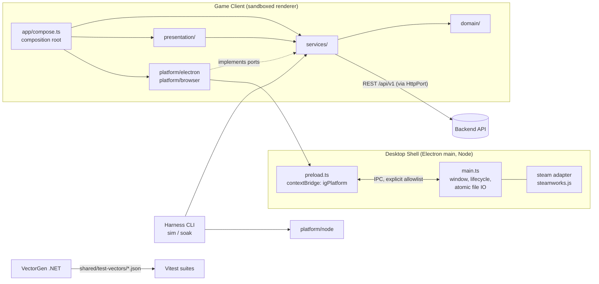

# Refactor: Unity Client → Phaser 4 — PRD

## Status

Launch-grade engineering PRD. The stakes come from the parent goal
([`../infinity-grove/PRD.md`](../infinity-grove/PRD.md)), which is a real paid PC/Steam
release. This document specifies **how the client is re-platformed**, not what the game
is. Game design, monetization and backend behavior are inherited unchanged. Builds on
[BRIEFING.md](./BRIEFING.md) and [BRAINSTORM.md](./BRAINSTORM.md).

**ID convention.** This PRD's requirements use `RFR-n` (functional) and `RNFR-n`
(non-functional) so they never collide with the game PRD's `FR-n` / `NFR-n`, which
this document cites as-is. IDs are global and stable; grouping is organizational only.

## 1. Problem

Infinity Grove is built by one developer working with Claude Code. In the Unity client,
the C# code was workable, but a large share of the game's real wiring lived where an
agent cannot reliably author or verify it:

- serialized scene and prefab YAML;
- Inspector-assigned references (`[SerializeField]` data arrays in `GameLifetimeScope`,
  and `RegisterComponentInHierarchy` presenters that must already exist in a scene);
- ScriptableObject content assets (`HeroData`, `StageData`, `MonsterData`,
  `EquipmentItemData`);
- Animator controllers and a Shader Graph;
- no CLI build or test loop at all (the current CLAUDE.md says so).

As a result, every feature ended with a manual editor step, and nothing could be
verified from a terminal. The existing `playable-vertical-slice` spec, for example,
still requires assigning `_heroPool` in a scene and doing a manual Play Mode pass.

**The re-platform's job:** a Phaser 4 + TypeScript client where *everything is code
or plain data files*. Build, run, test and package are all driven from the terminal.
The client stays a drop-in replacement for the existing backend.

## 2. Users

- **Primary: the developer + Claude Code as the build team.** The test of success
  is that an agent takes a game-PRD feature to working code, data and tests and
  proves it with terminal commands only. No editor, no hand-placed scene, no
  "press Play and look".
- **Secondary: players.** They should notice nothing at the design level: same game,
  same rules, same Steam distribution. Presentation fidelity (rendering, effects,
  fonts) may differ only where the developer has approved it visually
  ([RFR-44](#79-presentation-fidelity)).
- **Indirect: the backend.** Nothing in `Backend/` changes behavior. It must not be
  able to tell the new client from the old one at the wire level.

## 3. Scope Decisions Carried Into This PRD

Confirmed with the user in this phase. Each one shapes several requirements below.

- **S1. No save migration.** The project is pre-launch with no players. Encrypted
  Unity save files are not read, converted or imported. The new client chooses its own
  local save format, subject to the parent NFR-2.
- **S2. Bit-exact applies to wire formats only.** Big-number serialization
  (`mantissa`, `exponent`), event shapes and DTOs must match the backend exactly.
  Every other client-side rule (fusion preview, offline accrual, stage-outcome
  preview, damage) is a *prediction* that the backend reconciles (parent AD-6). It
  must agree with the backend's rules within the tolerance fixed in RFR-21, which is
  `exact` unless that table says otherwise.
- **S3. Steam Deck is a mandatory target**, on equal footing with Windows. Controller
  navigation, overlay and suspend/resume on SteamOS are acceptance criteria, not
  polish.
- **S4. UI technology is decided by a measured gate.** Menus default to a DOM layer
  over the canvas (hybrid). A one-screen spike
  ([RFR-48](#710-ui-technology-decision-gate)) either keeps that default or switches to
  Phaser-drawn menus, based only on pass/fail thresholds the agent measures and records
  itself. No subjective judgment is involved. Requirements in this PRD are written to
  hold either way.
- **S5. Visual fidelity is approved by the developer by eye.** There is no numeric or
  pixel-diff threshold. Approval uses side-by-side screenshots (Unity vs. Phaser).
- **S6. Design freeze.** A port PR never changes game behavior. A behavior change goes
  to the game PRD first and is implemented as a separate change.
- **S7. Hard cutover.** Unity and Phaser clients are not maintained in parallel past
  parity. Once the parity checklist is green, Unity is archived
  ([RFR-50](#711-cutover)).

## 4. Out of Scope / Non-Goals

- Any change to game design, tuning, content volume or the game PRD's FR list
  (see S6). New gameplay features that exist in the game PRD but not yet in the Unity
  client (5-hero on-screen combat, boss potions, Season Cave, Market UI, Summoning
  Stone purchase UI) are **not** part of parity. They are built later, on the new
  client, using the loop this PRD creates.
- Backend behavior changes. Allowed backend-side work in this re-platform is limited
  to: relocating `BreakInfinity.cs` (RFR-18), the test-vector generator (RFR-19), and
  exposing the existing OpenAPI document if it isn't already (RFR-25). None of these
  change runtime behavior. **One external dependency:** the backend crafting endpoint
  (RFR-41) is a behavior change. It is specified and delivered as a separate game-PRD
  change, not by this PRD, and P7 waits for it.
- Migrating Unity saves (S1).
- Unity editor tooling (`AudioEditor`, `WavUtility`, `BuildScript`). Dropped. Any
  remaining need becomes an npm script.
- Mobile and browser-hosted distribution. The build runs in a browser for
  development and testing, but the only shipped artifact is the Steam desktop
  package (parent NFR-6).
- Pixel-diff screenshot tests as CI gates (too flaky; see RFR-15).
- Compiling C# rules to WASM, or an automated C#→TS transpiler (set aside in
  Brainstorm).

## 5. Parity Baseline: What the Unity Client Does Today

"Parity" means exactly this list. It was taken from
`InfinityGrove/Assets/Scripts/Game/**`, not from the game PRD's full v1 scope.

| # | Capability | Unity source of truth |
|---|---|---|
| P1 | Main menu → game scene flow | `MainMenuPresenter` |
| P2 | Combat loop: Krell walks, encounters a monster, click-to-damage, monster death, gold reward | `CombatService`, `PlayerCombatService`, `DamageCalculator`, `CombatState`, `MonsterEntity`, `CombatPresenter`, `KrellPresenter`, `MonsterPresenter` |
| P3 | Equipment bonuses on player damage | `EquipmentService`, `Equipment`, `PlayerStats` |
| P4 | Roster and Active Squad (cap 5), bench, duplicates | `RosterRules`, `RosterService`, `HeroEntity`, `RosterPresenter` |
| P5 | Fusion with preview (tier, duplicates owned/required, next ability, 12★ cap) | `FusionRules`, `FusionPreview`, `FusionService`, `FusionPresenter` |
| P6 | Equipment inventory: shared bag, per-hero 4-slot loadout | `EquipmentInstance`, `EquipmentInventoryService`, `EquipmentPresenter` |
| P7 | Crafting / affix re-roll preview and request | `CraftingRules`, `CraftingPreview`, `CraftingService`, `CraftingPresenter` |
| P8 | Loadout presets by archetype | `LoadoutPreset`, `LoadoutPresetService`, `LoadoutPresetPresenter` |
| P9 | Stage select with Power Gate / Composition Mismatch preview and classification | `StageAttemptPreview`, `StageOutcomeClassifier`, `StageService`, `StageSelectPresenter` |
| P10 | Offline accrual on launch | `OfflineAccrualCalculator`, `OfflineAccrualResult` |
| P11 | Local save (encrypted, atomic) | `EncryptedSaveFileStore`, `SaveGameData` |
| P12 | Player event log + backend sync + reconciliation, with a player-visible correction notice | `PlayerEventLog`, `PlayerEventRecord`, `SaveSyncService`, `SaveSyncDriver`, `BackendApiClient`, `BackendSyncDtos`, `ReconciliationCorrection`, `ReconciliationNotificationPresenter` |
| P13 | Steam identity + cloud store, with dev/local stubs | `ISteamIdentityProvider` (Dev/Facepunch), `ISteamCloudStore` (LocalOnly/Facepunch) |
| P14 | Big-number math and formatting | `Shared/BreakInfinity.cs` |
| P15 | Hero-type display (type legibility, parent NFR-3) | `HeroTypeDisplay` |

The `playable-vertical-slice` work (starter-hero choice, content pools, combat drops)
is **not** in this baseline, because it is unfinished in Unity. It is paused and
re-specified against the new client after G3 (§11 note 4). Until then, the game is
still playable from a fresh start: the `new-player` fixture and the default new-game
state begin with one fixed starter hero defined in content data (RFR-14).

## 6. Delivery Phases and Gates

Ordering follows the Brainstorm's risk-first recommendation. A phase may overlap the
next, but a **gate** must pass before the work that depends on it is merged.

| Phase | Content | Exit gate |
|---|---|---|
| 0. Skeleton + harness | §7.1–7.4 scaffold, §7.7 shell spike, §7.5 relocation of `BreakInfinity.cs` | **G0:** all six shell-spike criteria (RFR-31) recorded as pass, or a documented shell switch; `npm run verify` green on an empty game |
| 1. Domain | 1:1 port under `PORT_MAP.md`, test vectors | **G1:** every Domain row in `PORT_MAP.md` is `done` and the vector suite is green |
| 2. Services | Save, event log, sync, backend client, Steam services | **G2:** end-to-end sync against a local backend passes in CI (RFR-29) |
| 3. Screens | P1–P15, combat first, then menus; UI gate (RFR-48) at the first menu screen | **G3:** parity checklist (RFR-49) all green. P7 needs the backend crafting endpoint (RFR-41), so G3 waits for it |
| 4. Fidelity | Krell animation, fireflies, lighting, fonts | **G4:** developer visual sign-off per item (RFR-44) |
| 5. Cutover | Archive Unity, rewrite docs | **G5:** RFR-50 / RFR-51 done |

## 7. Functional Requirements

### 7.1 Terminal-First Toolchain

- **RFR-1. Single-command workflows.** The client repo exposes npm scripts for
  every developer workflow, each runnable headless from a terminal on Windows:
  `dev` (hot-reload dev server), `test` (unit + integration), `test:e2e`
  (browser-driven), `typecheck`, `lint`, `validate:content`, `gen:assets`, `gen:api`,
  `sim`, `soak`, `build` (web bundle), `build:desktop` (installable Steam package)
  and `verify` (the full CI gate: typecheck + lint + validate:content + test +
  test:e2e + build).
  *AC:* From a clean clone, `npm ci && npm run verify` exits 0 with no GUI
  interaction. Each script's purpose is listed in the new CLAUDE.md (RFR-51).
- **RFR-2. No editor-only configuration.** No part of the game's runtime behavior,
  wiring, layout or content may depend on a file that can only be produced or edited
  by a visual tool. Binary art sources (e.g. `.aseprite`) are allowed as *inputs*
  only if a CLI export step turns them into checked-in runtime data (RFR-11).
  *AC:* An audit of the client repo finds no runtime-loaded file that lacks either a
  human-readable text format or a scripted generator.
- **RFR-3. CI runs the same gate.** The CI pipeline runs `npm run verify` on every
  push, on Windows and Linux runners. The Linux runner stands in for SteamOS, which
  is Linux-based.
  *AC:* A deliberately broken test, lint rule or content file each fails CI.

### 7.2 Composition and Layering

- **RFR-4. Layered modules.** Client code is split into `domain/` (pure rules and
  entities), `services/` (orchestration, persistence, network, platform via
  interfaces), `presentation/` (scenes, views, input), `platform/` (desktop shell and
  Steam adapters) and `content/` (data). This mirrors the Unity Data/Domain/Service/
  Presentation layering. It replaces parent AD-1.
- **RFR-5. Layer rules enforced by tooling.** The build fails if `domain/` imports
  anything outside `domain/` and the big-number library, or if `domain/` or `services/`
  import `phaser`, DOM globals, the desktop-shell API, Steam bindings or `fetch`
  directly. Network, file and platform access go through interfaces implemented in
  `platform/`.
  *AC:* `npm run lint` fails on a test fixture that violates each rule.
- **RFR-6. Composition root in code.** A single composition root constructs every
  service and wires it to presentation. Scenes and views receive dependencies; they
  never look them up globally or construct services. Swapping an implementation
  (e.g. dev Steam identity vs. real) is a code or config change in one place.
  *AC:* Every implementation that has a stub in Unity (`DevSteamIdentityProvider`,
  `LocalOnlyCloudStore`) has a TS equivalent selectable by config without code
  edits elsewhere.
- **RFR-7. Injected clock and RNG.** Domain and service code never call
  `Date.now()`, `performance.now()` or `Math.random()`. Time and randomness come
  from injected `Clock` and `Rng` interfaces. The RNG is seedable.
  *AC:* A lint rule bans the direct calls outside `platform/`. Running the same
  simulator script twice with the same seed produces byte-identical output.
- **RFR-8. Delta-based game loop.** All progression driven by time (combat ticks,
  accrual) is computed from elapsed clock time, not from a per-frame or per-timer
  count. Throttled, paused or delayed frames therefore delay results but never lose
  them.
  *AC:* A simulated 10-minute gap between ticks yields the same progression as 10
  minutes of normal ticks, within the S2 tolerance.

### 7.3 Content and Assets as Data

- **RFR-9. Content as validated data.** Heroes, monsters, stages, equipment items,
  affix ranges and any other content today held in ScriptableObjects live as
  version-controlled JSON (or TS) files. Each one is validated by a schema from which
  the TS types are derived.
- **RFR-10. Cross-reference validation.** `npm run validate:content` checks schema
  validity, unique IDs, and every cross-reference (e.g. a stage's monster IDs, a
  hero's portrait key, an equipment item's slot/archetype). It runs in `verify`.
  *AC:* A dangling reference, duplicate ID or out-of-range value each fails the
  command with a message naming the file and field.
- **RFR-11. Typed asset manifest.** A generator scans the assets folder and emits a
  typed manifest of asset keys (textures, atlases, animations, audio, fonts). Code
  refers to assets only through it. A misspelled key is a compile error.
  *AC:* `npm run gen:assets` is deterministic, and CI fails if the checked-in
  manifest is stale.
- **RFR-12. Adding content needs no code change.** Adding a hero, monster, stage or
  equipment item of an existing kind requires only new data and asset files, plus a
  regenerated manifest.
  *AC:* A scripted test adds a fixture hero and stage and the game boots with them
  visible in Roster and Stage Select, with no source edits.

### 7.4 Agent Verification Harness

- **RFR-13. Headless simulator.** `npm run sim -- --script <file> [--seed n]
  [--save <fixture>]` runs domain and service code without the rendering engine. It
  applies a scripted sequence of player actions and elapsed time, and prints the
  resulting state and emitted events as JSON.
  *AC:* Every parity item P2–P12 has at least one checked-in sim scenario whose
  output is asserted by a test.
- **RFR-14. Save-fixture library.** Checked-in save states cover at least:
  `new-player`, `mid-game`, `fusion-ready`, `full-squad-plus-bench` (>5 heroes,
  needed for parent FR-4 AC), `crafting-ready`, `pending-reconciliation` and
  `offline-8h`. The simulator, the dev URLs and the e2e tests all consume them.
  `new-player` matches the default new-game state: one fixed starter hero (named in
  content data, not code) in the Active Squad, so combat (P2) is playable from it.
  *AC:* `npm run sim` with `--save new-player` and a combat scenario yields at least
  one monster kill and a gold reward.
- **RFR-15. Boot-anywhere dev URLs.** In development and test builds, the client
  accepts launch parameters that select the starting screen, load a save fixture
  and fix the RNG seed and clock (e.g. `?scene=fusion&save=fusion-ready&seed=42`).
  Production builds ignore them.
  *AC:* Each parity screen can be reached directly in one navigation.
- **RFR-16. Semantic snapshot.** Every screen or view exposes a `describe()` output:
  a tree of `{role, label, enabled, value}` nodes describing what the player can see
  and do. In dev and test builds it is reachable through a debug hook. E2E tests
  assert on it instead of pixels.
  *AC:* For each parity screen, at least one e2e test asserts the state of its
  primary action (e.g. "Fuse button disabled, label states duplicates required").
- **RFR-17. Agent-readable screenshots.** `npm run test:e2e -- --screenshots` saves
  PNGs per screen and state to a known folder. Screenshots are for the agent and the
  developer to inspect. They never gate CI (see §4).

### 7.5 Domain Port and Rule Parity

- **RFR-18. Remove the backend's dependency on the Unity tree.** `BreakInfinity.cs`
  moves out of `InfinityGrove/Assets/Scripts/Shared/` into a location owned by the
  backend or a neutral shared folder, and `InfinityGrove.Backend.Domain.csproj` links
  it from there. This must happen **before** any Unity file is archived.
  *AC:* `dotnet build` and the backend's tests pass with the `InfinityGrove/` folder
  absent from disk.
- **RFR-19. Backend-generated test vectors.** A .NET test-tooling project under
  `Backend/` runs the backend's own domain rules over generated inputs. It writes
  JSON vectors covering at least: big-number arithmetic, comparison, formatting and
  `(mantissa, exponent)` serialization round-trip; fusion cost and tier rules;
  offline accrual; stage outcome classification; and event validation for each
  event type the client emits. Where a rule exists only in the Unity client and not
  in the backend, the vector is produced from the Unity C# source while it still
  exists, and recorded as such.
  *AC:* Vectors are regenerated by one terminal command and checked in. The TS
  suite consumes them in `npm test`.
- **RFR-20. Big-number edge coverage.** Vectors include zero, negative values (if
  the backend type permits them), values near 1, mantissa-normalization boundaries,
  very small and very large exponents, and values at the upper end of the parent
  FR-25 notation range.
  *AC:* Serialization round-trip is bit-exact (S2) for 100% of vectors. Ordering
  and comparison results match for 100% of vectors (parent NFR-1).
- **RFR-21. Tolerance for predictions.** Every vector family is `exact` by default.
  The only families allowed a relative tolerance are:

  | Family | Tolerance |
  |---|---|
  | Big-number arithmetic, comparison, format, wire round-trip | exact |
  | Damage (`DamageCalculator`, equipment bonuses) | exact |
  | Fusion cost/tier/preview, roster rules, loadout presets | exact |
  | Stage attempt preview and outcome classification | exact |
  | Crafting ranges and costs | exact |
  | Event payloads and event validation | exact |
  | Offline accrual (`OfflineAccrualCalculator`) | relative 1e-9 |
  | Catch-up equivalence: step simulation vs. accrual across the cap (RFR-8, ARCH F3) | relative 1e-6 |

  Any new relative tolerance, or a change to one above, requires a written
  justification in `PORT_MAP.md` and an edit to this table. The TS suite enforces the
  value declared in the vector file, which must equal this table.
  *AC:* A test fails if any vector file declares a tolerance that differs from this
  table.
- **RFR-22. Port map.** `PORT_MAP.md` lists every Unity `.cs` file in
  `Scripts/Game` and `Scripts/Shared`. Each one maps to its TS destination (or
  "dropped" with a reason) and has a status (`todo` / `in-progress` / `done` /
  `dropped`). Domain is ported 1:1 by file and public name unless the map records a
  reason.
  *AC:* G1 requires all Domain rows `done`. G3 requires all rows `done` or
  `dropped`.
- **RFR-23. Domain unit tests.** Every ported Domain module has unit tests, in
  addition to the vectors, covering the rules the game PRD attaches to it (e.g.
  parent FR-3's cap of 5, FR-6's 12★ cap, FR-11's two-way classification,
  FR-4's benched-hero contribution of zero).

### 7.6 Services Parity

- **RFR-24. Local save.** The client persists its save (last reconciled state plus
  unsynced events, as in parent AD-9) in the desktop shell's per-user data folder. It
  is written atomically (temp file + rename) and encrypted or obfuscated at least to
  the Unity client's level. Format is new (S1).
  *AC:* A test that kills the write mid-way leaves the previous save loadable
  (parent NFR-2).
- **RFR-25. Generated API contract.** The backend's REST `/api/v1` DTOs and client
  are generated from the backend's OpenAPI document by `npm run gen:api`. No DTO is
  hand-written.
  *AC:* CI fails if the generated client is stale relative to the checked-in OpenAPI
  document. A renamed backend field breaks `typecheck`.
- **RFR-26. Event log.** Every state change the Unity client recorded as a
  `PlayerEventRecord` is recorded with the same event types and payload shapes, in
  an append-only local log with the same sync statuses.
  *AC:* For each event type, a vector from RFR-19 proves the backend accepts the
  serialized TS event.
- **RFR-27. Sync and reconciliation.** The client syncs periodically while online
  and on pause/quit (parent AD-6). It applies the canonical state the backend
  returns. When the backend rejects an event, it shows the player a correction notice
  equivalent to `ReconciliationNotificationPresenter`.
- **RFR-28. Offline accrual.** On launch, the client computes offline accrual from
  the persisted last-seen timestamp using the ported calculator, and displays the
  result as the Unity client does (P10).
- **RFR-29. End-to-end sync test.** CI starts the backend and PostgreSQL (existing
  `docker-compose`) with a test Steam identity. It drives the client's services
  through auth → actions → sync → reconciliation, including one deliberately
  rejected event.
  *AC:* This test is the G2 gate.
- **RFR-30. Dev and offline modes.** Like the Unity stubs, the client can run with
  no backend and no Steam (dev identity, local-only cloud store), selected by
  config.
  *AC:* `npm run dev` with default config boots to a playable game with no network.

### 7.7 Desktop Shell and Steam

- **RFR-31. Shell spike with exit criteria.** Before any screen work is merged
  (G0), a minimal build (empty scene, real shell, real Steam bindings) must
  demonstrate, on **both Windows and Steam Deck**:
  1. a Steam auth ticket is accepted by the real `/api/v1` auth endpoint;
  2. a Steam Cloud write → read round-trip succeeds;
  3. the Steam overlay renders over the game and responds to input;
  4. a sandbox microtransaction authorization callback (parent AD-12) reaches the
     client while the overlay is shown;
  5. the window minimized or hidden for 1 hour loses no progress (RFR-8);
  6. installed size, idle RAM and idle CPU are recorded.

  *AC:* Results are recorded in the spec folder with the date and machine. Criteria
  1–5 must pass. If they fail with the default shell (Electron 44 + the project's
  steamworks.js fork, ARCH AD-3/AD-13), the shell choice is reopened in Architecture
  before Phase 1 continues.
- **RFR-32. Steam identity.** The client obtains a Steam auth session ticket and
  exchanges it with the backend for a session token (parent AD-5/AD-10). No
  credential is stored other than the backend's token.
- **RFR-33. Steam Cloud.** The local save syncs through Steam Cloud (parent FR-44).
  - **Write:** the encrypted save envelope is written to Steam Cloud after every
    successful backend sync/reconciliation and on quit.
  - **Read:** on every boot, the Cloud copy is read and compared with the local save
    by `lastReconciledAtMs` (the time of the last backend-confirmed state). The newer
    one becomes the local save, **except** that a local save holding unsynced events is
    never replaced. After that, backend reconciliation decides (parent NFR-2 / AD-9).
  *AC:* Tests cover: no local save → Cloud copy is used; Cloud newer and local has no
  unsynced events → Cloud wins; Cloud newer but local has unsynced events → local
  kept; local newer → local kept and later written to Cloud.
- **RFR-34. Overlay and microtransaction readiness.** The client can open the Steam
  overlay and receive the microtransaction authorization response, so that the
  later Summoning Stone UI (parent AD-12) has nothing left to prove at the platform
  level. The client never calls a mutating Steam Inventory or microtransaction
  API itself (parent AD-4).
- **RFR-35. Background behavior.** The shell does not throttle the game when the
  window is hidden, minimized or unfocused. On Steam Deck suspend/resume, the game
  resumes with progress computed from elapsed time (RFR-8).
- **RFR-36. Installable package.** `npm run build:desktop` produces a Windows and a
  Linux (SteamOS) build that can be uploaded as a Steam depot without further manual
  steps. Steam app ID and depot configuration are data in the repo.
  *AC:* The Linux build launches through Steam on a Steam Deck in Game Mode.

### 7.8 Screen and Feature Parity

Each item below is done when it reaches the parity definition in RFR-49.

- **RFR-37. Main menu (P1)** with background, logo, music and a transition into the
  game.
- **RFR-38. Combat loop (P2, P3).** Krell walks, encounters a monster, takes
  click/tap damage with equipment bonuses applied, the monster dies, gold is awarded
  and displayed in big-number notation, and the loop continues.
- **RFR-39. Roster and Active Squad (P4, P15)**, including the cap of 5, bench,
  duplicate/fusable marking (parent FR-47) and hero-type display that does not rely
  on color alone (parent NFR-3).
- **RFR-40. Fusion (P5)** with the preview data the parent FR-6 AC lists, plus the
  12★ cap state.
- **RFR-41. Equipment, crafting and loadout presets (P6, P7, P8).** Crafting keeps
  the parent AD-15 rule: the client never computes an affix roll locally. It only
  shows the preview and the server's result. The roll and the gold debit come from a
  backend crafting endpoint that does not exist today. That endpoint is a separate
  game-PRD change (§4), so the Unity client's local roll is **not** ported. P6 and P8
  proceed independently. P7's crafting request is built only once the endpoint
  exists, and G3 waits for it.
  *AC:* No code path in the client computes an affix roll result. A crafting request
  in the sim against `NoBackend` returns "unavailable" and changes no state.
- **RFR-42. Stage select (P9)** with modifier, squad composition, risk preview
  before attempt (parent FR-46), and distinct Power Gate vs. Composition Mismatch
  presentation (parent FR-11).
- **RFR-43. Input parity across devices.** Every parity screen is fully usable with
  mouse, with keyboard, and with a gamepad / Steam Deck controls (S3). Focus is
  always visible, and no action requires a pointer.
  *AC:* An e2e test drives each parity screen's primary action using only
  gamepad/keyboard input events.

### 7.9 Presentation Fidelity

- **RFR-44. Visual sign-off.** Each of the following has a side-by-side screenshot
  (Unity vs. Phaser, same state) approved by the developer (S5) before G4:
  Krell idle/walk/punch animation; firefly effect; scene lighting; Cinzel Decorative
  typography; the gradient button style; backgrounds and card frames.
  *AC:* Approval is recorded per item (checklist in the spec folder). A rejected item
  stays open; it does not block G3.
- **RFR-45. Animations defined in code/data.** Character animations are built from
  atlas/animation data files produced by a scripted export (RFR-2). No animation
  state machine lives in a binary editor asset.
- **RFR-46. Effects in code.** The firefly effect and any lighting are implemented
  in code (particles, filters/shaders) with parameters in data. They can be toggled
  off for low-spec mode and tests.
- **RFR-47. Audio.** Music and SFX present in the Unity client play at equivalent
  points, with volume settings persisted.

### 7.10 UI Technology Decision Gate

- **RFR-48. Roster spike decides the menu UI technology (S4).** The Roster screen is
  built first as a spike in the hybrid approach (DOM menus over the Phaser canvas).
  The hybrid approach **passes** only if all of the following hold, measured by the
  agent (criteria 1–3 in the e2e suite, criterion 4 on Steam Deck):
  1. a gamepad-only focus-walk reaches 100% of the interactive nodes in `describe()`;
  2. 200 scripted gamepad navigations produce 0 failures (focus lost, stuck, or on a
     node not in `describe()`);
  3. the visible focus updates within 100 ms of the input, at p95;
  4. after opening and closing the Steam overlay 10 times, game input resumes within
     1 s each time and no input leaks to the game while the overlay is open;
  5. `describe()` covers every visible element and action of the screen (RFR-16).

  If all pass, all menus follow the hybrid approach. If any fails, menus are built in
  Phaser behind the same controllers, and `describe()` remains the testing seam.
  *AC:* The measured values, pass/fail per criterion and the resulting decision are
  recorded in `UI_GATE.md` before a second menu screen is started.

### 7.11 Cutover

- **RFR-49. Parity definition and checklist.** A parity checklist lists P1–P15 from
  §5. An item is green when all of these hold: (a) its sim scenario and/or e2e test
  passes in CI; (b) its Domain/Service rows in `PORT_MAP.md` are `done`; (c) the
  developer has done one manual playthrough of it on Windows and on Steam Deck; (d)
  any differences from Unity behavior are zero, or are listed and accepted under S2
  tolerance.
- **RFR-50. Archive Unity.** Within one week of G3 + G4: RFR-18 is verified, the
  `InfinityGrove/` Unity project is removed from the active tree (kept in git history
  or a tagged archive branch), and Unity-specific references in active specs are
  updated or marked historical.
  *AC:* No build, test or script in the repo references `InfinityGrove/`.
- **RFR-51. Rewritten agent documentation.** CLAUDE.md is rewritten for the new
  client: commands (RFR-1), layer rules (RFR-5), how to add a hero, monster, stage
  or item (RFR-12), how to verify a feature (RFR-13–17), and the design-freeze rule
  (S6). The "no CLI build or test commands" statement is removed.

## 8. Non-Functional Requirements

- **RNFR-1 (Determinism).** Every automated test is deterministic: injected clock
  and seed, no real network except in the RFR-29 suite, and no wall-clock waits. A
  flaky test is a defect, not something to retry.
  *AC:* `npm test` run 20 times in a row gives identical results.
- **RNFR-2 (Fast feedback).** `npm test` (unit + vectors + sim) finishes in under 60
  seconds on the developer's machine. `npm run verify` finishes in under 10 minutes
  in CI. `[ASSUMPTION — targets inferred, not stated by the user]`
- **RNFR-3 (Long-session stability).** `npm run soak` simulates at least 24
  in-game hours at accelerated speed and fails if either bound is exceeded:
  - retained heap grows by **50 MB or more** between the end of warm-up (1 simulated
    hour) and the end of the run;
  - with a backend reachable, the unsynced event log holds more events than were
    produced in **2 sync intervals**.

  A real-time 4-hour run on Steam Deck shows no visible stutter growth and no crash.
- **RNFR-4 (Performance).** On Steam Deck, combat holds 60 fps with all parity
  effects on, and the menus respond to input within 100 ms. When hidden or idle, the
  game uses **at most 5% of one CPU core**.
- **Threshold revision rule (RNFR-3/4).** The values above are provisional and active
  from G0. At G0 the agent may tighten them from the RFR-31 baseline without
  approval. Loosening any of them needs a written justification approved by the
  developer.
- **RNFR-5 (Footprint).** Installed size and idle RAM are recorded at G0 and
  re-checked at G3. A regression of more than 25% between those points needs a
  written justification. No absolute ceiling is set. `[ASSUMPTION — no target was
  given; recording is the requirement]`
- **RNFR-6 (Wire compatibility).** The backend must not need any change to serve
  the new client. Big-number serialization and event payloads are bit-exact (S2).
- **RNFR-7 (Inherited game NFRs).** Parent NFR-1 (numeric integrity), NFR-2 (save
  reliability), NFR-3 (type legibility) and NFR-4 (server authority) apply
  unchanged to the new client. Nothing in this re-platform may weaken them.
- **RNFR-8 (Secrets).** No backend publisher key, Steam Web API key or other server
  secret ever ships in the client bundle or repo client folder. A CI check scans the
  built bundle for known secret patterns.
- **RNFR-9 (Shell security).** The game's renderer runs without direct Node/OS
  access. Platform capabilities (files, Steam) are exposed through a narrow,
  explicitly listed bridge. Dev-only launch parameters (RFR-15) and debug hooks
  (RFR-16) are absent from production builds.
- **RNFR-10 (Platforms).** Windows 10/11 x64 and Steam Deck (SteamOS) are both
  required (S3). Other Linux desktops get the same build but no acceptance testing.
- **RNFR-11 (Agent operability).** Every failure reported by `verify`, `sim`,
  `validate:content` or `soak` names the file, entity or test involved in plain text.
  The agent should not have to read a screenshot or a debugger to find the cause.

## 9. Success Metrics (with counter-metrics)

Success here is measured on the build process, since the player-facing game doesn't
change.

| # | Metric | Counter-metric | Why paired |
|---|---|---|---|
| 1 | Share of game-PRD features merged after cutover with **zero** manual editor/GUI steps, verified only by terminal commands. Target: 100% | Defects found in the developer's manual playtest that all automated checks had passed | High automation that lets real bugs through means the tests assert the wrong things. |
| 2 | Parity checklist completion (P1–P15) | Count of behavior changes found in port PRs (S6). Target: 0 | Fast parity reached by quietly redesigning would break the drop-in promise. |
| 3 | Vector-suite pass rate. Target: 100% | Number of tolerances loosened (RFR-21) since first green run | A suite made green by widening tolerances proves nothing. |
| 4 | Time from "agent starts a game-PRD feature" to green `verify` on the new client | Rework rate: share of such features reopened within 2 weeks | Speed bought with shallow verification shows up as rework. |
| 5 | Shell spike criteria passed on both platforms (RFR-31) | Platform-specific bugs filed after G0 for overlay, suspend/resume or controller input | A spike that passes once but leaves the platform fragile is a false signal. |

## 10. Risks and Dependencies

- **[BLOCKER] Backend links `BreakInfinity.cs` from the Unity tree.** RFR-18 removes
  it. Archiving Unity first would break the backend build.
- **[RISK, highest] Steam overlay inside a Chromium-based shell**, on Windows and
  SteamOS. It is required for the AD-12 microtransaction flow. If RFR-31 criteria
  3/4 fail, the shell choice reopens.
- **[RISK] Exact capabilities of the Steam bindings** (auth ticket for Web API,
  Cloud, microtransaction callback) are assumed and only verified by RFR-31.
- **[RISK] Big-number library edge behavior** may differ subtly from
  BreakInfinity.cs (normalization, rounding). RFR-19/20 are the mitigation.
- **[RISK] Controller navigation over DOM menus on Steam Deck** decides the UI
  approach (RFR-48).
- **[RISK] Phaser 4 is a newer major version** with less training-data coverage
  than v3. It is partly offset by the Phaser 4 skills available to the agent.
- **[FACT] No test suite exists on either side.** The oracle (RFR-19) is built
  from scratch, not ported.
- **[DEPENDENCY] Steam sandbox/partner access** for microtransaction testing and
  a Steam Deck dev device are needed by RFR-31.
- **[DEPENDENCY] Backend crafting endpoint** (separate game-PRD change) is needed by
  P7/RFR-41 and therefore by G3.

## 11. Reviewer Notes: Flags for the User

Open calls, surfaced rather than silently resolved:

1. **Rules that live only in the Unity client.** Some client-side rules (e.g. combat
   damage, stage-outcome preview) may have no backend counterpart to generate
   vectors from. RFR-19 falls back to the Unity C# source while it exists, which
   means the vectors for those rules have to be generated **before** cutover.
   Architecture should list which rules fall into this case.
2. **Performance and footprint numbers.** RNFR-3/4 now carry provisional thresholds
   confirmed by the developer, with a tighten-freely / loosen-with-approval rule at
   G0. RNFR-2 and RNFR-5 remain assumptions.
3. **The art source of truth is still open.** RFR-45 requires a scripted export but
   doesn't choose between Aseprite source + CLI export (Brainstorm's preference) and
   a one-time re-slice of the Unity sheets. Aseprite needs a CLI license on any
   machine that regenerates art, including CI if CI regenerates it. Architecture
   decision.
4. **`playable-vertical-slice` is paused, not cancelled (confirmed).** That spec
   targets Unity (assigning `_heroPool` in a scene, Play Mode passes). It is
   re-specified against the new client after G3, not finished in Unity. There is no
   starter-hero *choice* until then, but a new game is still playable: it starts with
   one fixed starter hero defined in content data (§5, RFR-14).
5. **A one-week cutover window (RFR-50)** is strict on purpose. If G4 visual sign-off
   drags on, should Unity be archived at G3 with fidelity items left open? As
   written, the answer is no: the window counts from G3 **and** G4.
6. **The CI Linux runner stands in for SteamOS (RFR-3)** for automated tests only.
   Overlay, controller and suspend behavior can only be checked on a real Deck. That
   check is manual (RFR-31, RFR-49c), and it is the one part of the loop that isn't
   terminal-verifiable.

---

*One solution. The Phaser client, its desktop shell, the verification harness and the
parity vectors together make a single deliverable: a drop-in game client. No
`SOLUTIONS.md`.*


# Refactor: Unity Client → Phaser 4 — Architecture

## Status

Fast-path spine for [PRD.md](./PRD.md). It is a consistency contract for the new client:
it fixes the invariants that keep independently built modules from diverging, and it
seeds the starting structure. Once code exists, the code owns the structure.
`[ASSUMPTION]` marks anything inferred rather than confirmed.

**Confirmed with the user in this phase:**

- `Client/` monorepo folder, sitting next to `Backend/`.
- GitHub Actions for CI.
- Electron 44 + a project-owned steamworks.js fork as the default shell (AD-3/AD-13).
- Crafting's affix roll is server-side only; P7 waits for a backend crafting endpoint
  delivered as a separate game-PRD change (AD-22).
- The menu UI gate (RFR-48) is decided by measured thresholds, not by judgment.
- Vector tolerances are `exact` by default, per the PRD RFR-21 table.
- Content reaches `compose()` through a `ContentSource` port (AD-8).
- Steam Cloud: write after every sync and on quit, compare on every boot (AD-20).
- RNFR-3/4 provisional thresholds are active from G0.
- Animated art comes from Aseprite + CLI export. The existing PNG sheets are wrapped once
  in Aseprite-format JSON.
- Preact + signals for DOM menus, if the RFR-48 gate approves the hybrid UI.
- An own Steam App ID with microtransaction sandbox access exists.

**This document supersedes, for the client only,** these decisions of the parent
[`../infinity-grove/ARCHITECTURE.md`](../infinity-grove/ARCHITECTURE.md):

- AD-1 (VContainer) → replaced by AD-1/AD-4 here.
- AD-4/AD-5 client side (Facepunch) → replaced by AD-13 here.
- AD-7 library → replaced by AD-7 here.
- AD-9 storage location → replaced by AD-12 here.

Parent AD-2/3, AD-6, AD-8–AD-15 remain binding, unchanged.

**Facts read from the repo that shaped decisions:**

- The backend's Swashbuckle OpenAPI is served only in Development.
- `IngestEventRequest.Payload` is an untyped `JsonElement`.
- `Steamworks:WebApiBaseUrl` is configurable.
- The backend Domain implements only BreakInfinity, `CardFusionCostCurve` and event
  validation.
- Of the Unity Domain files, only `MonsterEntity.cs` imports `UnityEngine`.
- Unity `CraftingService` rolls affixes locally.
- No `.aseprite` sources exist.

## Componentes

- Game Client (Phaser 4 + TypeScript renderer bundle; runs in a browser for dev/test and inside the Desktop Shell for release)
- Desktop Shell (Electron main + preload bridge + Steam adapter; the shipped Windows/SteamOS package)
- Verification Harness CLI (Node: `sim`, `soak`, `validate:content`, generators)
- Test-Vector Generator (.NET console tool under `Backend/tools/`)
- Backend API Service (existing, unchanged; consumed over `/api/v1`)

## System shape



## Seed: repository layout `[seed — the code owns this after scaffold]`

```
/Backend/                       existing; + tools/InfinityGrove.VectorGen/, + Domain/Shared/BreakInfinity.cs
/shared/openapi/openapi.json    exported from backend, checked in
/shared/test-vectors/*.json     generated, checked in
/Client/
  src/domain/                   pure rules + entities (1:1 port of Scripts/Game/Domain + Data shapes)
  src/services/                 orchestration, state store, ports (interfaces), event log, sync
  src/presentation/             Phaser scenes, views/screens, input router, theme, (ui-dom/ if hybrid)
  src/platform/{browser,electron,node}/   port implementations
  src/app/                      compose.ts, config.ts, boot.ts, dev-hooks.ts
  src/generated/                assets.gen.ts, api/  (never hand-edited)
  desktop/{main,preload}/       Electron process code
  content/<kind>/*.json         heroes, monsters, stages, equipment, affixes, animations
  assets/                       runtime PNG/atlas/audio/fonts;  art-src/*.aseprite
  tools/                        sim.ts, soak.ts, validate-content.ts, gen-*.ts, art-*.ts
  fixtures/saves/*.json         RFR-14 library;  scenarios/*.json  sim scripts
  tests/{unit,vectors,sim,e2e,shell}/
  steam/                        app_build + depot .vdf files
  PORT_MAP.md
```

## AD-N Decisions

### AD-1 — Paradigm: functional core, ports-and-adapters shell, four layers with one-way dependencies
- **Decision:** `domain/` is a pure functional core. It has no I/O, no time, no randomness
  except through arguments. `services/` is the application layer. It owns state, defines
  every port (interface) for I/O, and orchestrates domain calls. `presentation/` renders
  and translates input into service commands. `platform/` and `desktop/` implement ports.
  The allowed imports are:
  - `domain` → `domain` and `break_infinity.js` (via AD-7 only);
  - `services` → `domain`, `zod` (content and payload schemas, AD-8/AD-11),
    `src/generated/**` (API types and asset manifest, AD-9/AD-10) and `openapi-fetch`
    (only inside `services/backend/`, AD-10). Nothing else;
  - `presentation` → `services`, `domain` (types and pure formatters only, see F5),
    `src/generated/assets.gen.ts`, `phaser`, `preact`, `@preact/signals`;
  - `platform` → `services` ports;
  - `app/` → everything.

  This list is the exact allowlist the `dependency-cruiser` config encodes. Adding an
  entry means amending this AD (and AD-3 for a new package).
- **Reason:** It mirrors the Unity Data/Domain/Service/Presentation split, so the port stays
  1:1. It makes everything below `presentation/` runnable headless (sim, soak, vectors).
- **Trade-off:** Interface ceremony for every I/O touchpoint, even trivial ones.
- **Impact:** Enforced by `dependency-cruiser` rules in `npm run lint`, plus negative
  fixtures (RFR-5). A new module that needs I/O defines a port in `services/` first.

### AD-2 — Monorepo layout; backend owns `BreakInfinity.cs`; `shared/` holds cross-language contracts
- **Decision:** The client lives in `Client/` as a single npm package with no workspaces.
  `BreakInfinity.cs` moves to `Backend/src/InfinityGrove.Backend.Domain/Shared/` as a real
  file, and the `<Compile Include>` link to the Unity tree is deleted. That move is the
  first merged change (RFR-18). Contracts consumed by both languages live in `shared/`:
  `openapi/` (backend → client) and `test-vectors/` (backend tool → client tests). Nothing
  in `Client/` reads from `Backend/` directly, and vice versa, except the generators named
  in AD-10 and AD-18.
- **Reason:** One clone runs the RFR-29 end-to-end test and both generators. The C# client
  is gone, so a neutral `shared/dotnet/` would have one consumer.
- **Trade-off:** The client and backend version together. Splitting repos later means
  publishing `shared/`.
- **Impact:** CI's backend job asserts `dotnet build` with `InfinityGrove/` deleted (RFR-18
  AC) from G0 onward.

### AD-3 — Stack (majors fixed here; exact versions pinned in the lockfile at scaffold)
- **Decision:**
  - Node 24 LTS (`engines` + `.nvmrc`)
  - TypeScript strict, ESM
  - Vite (renderer bundle + dev server)
  - **Phaser 4.2.x** (current stable as of 2026-07, v4.2.1)
  - Vitest (unit/vectors/sim)
  - Playwright (e2e on Chromium + `_electron` shell smoke)
  - zod (content and payload schemas)
  - `break_infinity.js`
  - Preact + `@preact/signals` (only under the AD-15 hybrid outcome)
  - **Electron 44.x** (current stable major as of 2026-09) + electron-builder. A
    different major is an amendment to this AD.
  - **Steam binding: project-owned fork of steamworks.js** in `Client/vendor/steamworks.js/`
    (Rust/napi-rs), pinned to an upstream commit recorded in the fork's README. The
    fork adds two things upstream lacks: `GetAuthTicketForWebApi` (RFR-31 criterion 1)
    and a stable `MicroTxnAuthorizationResponse_t` callback (criterion 4). Prebuilt
    binaries for win-x64 and linux-x64 are produced by an npm script and checked in.
    Upstream steamworks.js is the fallback only if the fork cannot be built.
  - `openapi-typescript` + `openapi-fetch`
  - ESLint + dependency-cruiser
  - `tsx` for CLI tools
- **Reason:** These are mainstream, terminal-driven tools with strong agent familiarity.
  Phaser 4 skills already exist in this environment.
- **Trade-off:** Phaser 4 is a young major version. Owning a native-binding fork means
  rebuilding it on Electron major upgrades and Steamworks SDK updates. AD-13's single
  adapter keeps that cost local.
- **Impact:** Adding a runtime dependency to `domain/` or `services/` requires amending this
  AD.

### AD-4 — Composition root in code; constructor injection; no container, no globals
- **Decision:** `app/compose.ts` exports `compose(config: AppConfig, platform: PlatformPorts): AppContext`,
  which constructs every service once. Phaser scenes and screen controllers are instantiated
  by the app with `new XScene(ctx)` and registered via `game.scene.add`. They never read
  services from `this.registry`, module singletons or `window`. `AppConfig` selects
  implementations (`identity: dev|steam`, `cloud: local|steam`, `backend: url|none`,
  `effects: on|off`, `devHooks: bool`). The sim and soak tools call the same `compose()`
  with `platform/node` ports.
- **Reason:** It removes the `GameLifetimeScope`/Inspector wiring problem. Sim, e2e and
  release share one wiring path.
- **Trade-off:** Manual wiring code grows linearly with services.
- **Impact:** RFR-6 stub parity: `DevSteamIdentity`, `LocalOnlyCloudStore`, `NoBackend`
  exist as TS implementations selected only by `AppConfig`.

### AD-5 — State ownership and mutation: services are the only writers; every persisted change is a command that emits an event
- **Decision:** A single `GameStore` in `services/state/` holds the immutable `GameState`
  snapshot. Every mutation goes through a service command that follows these steps:
  1. validate with domain rules;
  2. compute the next state with a domain function;
  3. append a `PlayerEvent` to the event log when it changes persisted progress (parent
     AD-6);
  4. commit to `GameStore`;
  5. notify subscribers.

  Presentation reads via `store.select(fn)` (framework-agnostic observable). The Preact
  adapter wraps it in signals, and Phaser views subscribe directly. Presentation never
  mutates state, and domain entities are never shared mutable references across layers.
  Domain classes keep their Unity public names (AD-19), but state transitions return new
  values.
- **Reason:** One write path makes the event log complete by construction, sim output
  deterministic, and `describe()` consistent with what is rendered.
- **Trade-off:** Copy-on-write overhead on every tick, which is cheap at this game's
  entity counts.
- **Impact:** A lint rule bans importing `GameStore.commit` outside `services/`. A sim test
  asserts that every persisted-field change between two states has a matching event.

### AD-6 — Time, randomness and identity are injected ports; the loop is delta-based with a bounded catch-up
- **Decision:** `Clock` (`nowMs()`), `Rng` (seedable sfc32 in `domain/rng.ts`, seeded by
  platform at boot) and `IdGenerator` (UUIDv4 from `Rng`, used for `clientEventId`) are
  passed in. `TickDriver` (services) receives `advance(elapsedMs)` from Phaser's update, the
  sim or the debug hook. It steps the simulation in fixed 100 ms steps, up to a catch-up
  cap of 60 s `[ASSUMPTION — tunable]`. Any remainder beyond the cap goes through
  `OfflineAccrualCalculator`, the same path used at launch (P10). Pause/suspend/hidden is
  just a large `elapsedMs`.
- **Reason:** It covers RFR-7/RFR-8/RNFR-1: throttling delays but never loses progress, and
  tests never wait on wall time.
- **Trade-off:** Above the cap, progression uses the accrual formula, not step simulation.
  The two must agree within the RFR-21 tolerance (see Reviewer flag F3).
- **Impact:** ESLint `no-restricted-syntax/globals` bans `Date.now`, `performance.now`,
  `Math.random`, `crypto.randomUUID`, `setTimeout`/`setInterval` in `domain/` and
  `services/`.

### AD-7 — Big numbers: `break_infinity.js` behind one domain module; wire format is `{ mantissa, exponent }`
- **Decision:** `domain/bignum/` is the only importer of `break_infinity.js`. It exports
  the `Big` type, the arithmetic and comparison used by the game, `formatBig()` (parent
  FR-25 notation), and `toWire()`/`fromWire()`, which produce and accept exactly the
  backend's `(mantissa: double, exponent: int)` shape. Normalization rules match
  `BreakInfinity.cs` as proven by vectors, not by assumption.
- **Reason:** Edge-case divergence is contained in one file. The library can be swapped or
  patched without touching callers.
- **Trade-off:** It wraps a library that is already small.
- **Impact:** RFR-20 vectors run against this module. Any mismatch is fixed here, never at
  call sites.

### AD-8 — Content is JSON validated by zod schemas; types are inferred; references are checked
- **Decision:** One file per entity: `content/<kind>/<id>.json`, with stable kebab-case
  string IDs. Schemas in `src/services/content/schema.ts` are the source of the TS types
  (`z.infer`).
  - **Loading:** `services/content/ContentSource` is a port returning raw
    `{ path, json }[]` per kind. Implementations: `platform/browser/GlobContentSource`
    (Vite `import.meta.glob`, used by dev, test and release builds) and
    `platform/node/FsContentSource` (reads `Client/content/**` from disk, used by `sim`,
    `soak`, `validate:content` and Vitest). `compose()` receives it as part of
    `PlatformPorts`. `import.meta.glob` appears nowhere outside `platform/browser/`.
  - **Validation:** one `ContentLoader` in services runs schema + uniqueness +
    cross-reference checks (monster IDs in stages, asset keys against `assets.gen.ts`,
    slot and archetype enums) on whatever the source returns, in `validate:content` and
    at every boot.

  Domain receives already-parsed plain objects and never imports zod.
- **Reason:** RFR-9/10/12: adding content is a data change, and errors name the file and
  field (RNFR-11).
- **Trade-off:** There is no visual editor. Bulk tuning is done by editing JSON or a script.
- **Impact:** The backend's hero definition GUIDs (`RosterEntryDto.HeroDefinitionId`) are a
  required field on hero content, so the client maps backend state to content without a
  lookup table elsewhere.

### AD-9 — Assets: generated typed manifest; Aseprite JSON is the single animation format
- **Decision:** `gen:assets` scans `Client/assets/` and writes `src/generated/assets.gen.ts`.
  The output is deterministic and sorted, and CI fails if it is stale. Every animated sprite
  is a PNG + Aseprite-format JSON (frame tags = animation states), loaded with
  `load.aseprite` and created with `anims.createFromAseprite`.
  - Existing Unity PNG sheets (Krell, Ranger, Druid) get their JSON once from `art:slice`
    (frame grid + tags as script arguments). The PNG + JSON pair is then the checked-in
    source.
  - New art lives in `art-src/*.aseprite`. `art:export` calls the Aseprite CLI, which needs
    a local license.
  - CI never runs Aseprite. It validates the checked-in JSON and manifest.

  Animation state → tag mapping lives in `content/animations/*.json`.
- **Reason:** RFR-2/11/45: no binary-editor state at runtime, and one loader path.
- **Trade-off:** Editing legacy-sheet animations means editing JSON until someone migrates
  them into `.aseprite`.
- **Impact:** Code references assets only via `Assets.*` keys. A raw string key fails lint.

### AD-10 — API contract: the backend exports OpenAPI to a file; the client generates types and a fetch client
- **Decision:** A build-time OpenAPI export (Swashbuckle CLI `swagger tofile`, a tooling-only
  addition to the Api project) writes `shared/openapi/openapi.json`. `gen:api` generates
  `src/generated/api/` with `openapi-typescript` + `openapi-fetch`. The generated client is
  only used inside `services/backend/BackendApiClient`, which receives an `HttpPort` (no
  direct `fetch`). Like the Unity client, every call resolves to a `Result` (never throws to
  callers). CI regenerates both files and fails on diff.
- **Reason:** RFR-25: a backend field rename breaks `typecheck`.
- **Trade-off:** It adds a CLI tool dependency to the backend build. There is no runtime
  change.
- **Impact:** Event *payloads* are not covered (opaque `JsonElement`). See AD-11.

### AD-11 — Event payload contract comes from backend-generated vectors, not from OpenAPI
- **Decision:** `services/events/payloads.ts` defines one zod schema per `PlayerEventType`.
  VectorGen serializes each backend `EventPayloads.cs` record (System.Text.Json, the
  backend's options) into `shared/test-vectors/event-payloads.json`. The TS suite asserts:
  1. TS serialization of each case is byte-identical JSON, with key order normalized;
  2. each vector parses with the schema.

  Event envelope fields come from generated OpenAPI types. The log keeps the Unity sync
  statuses and the monotonic `sequenceNumber`.
- **Reason:** S2/RNFR-6 demand bit-exact payloads, and OpenAPI cannot describe them.
- **Trade-off:** The schemas are hand-written. They are guarded by vectors, not generated.
- **Impact:** Adding an event type means a backend payload record, a VectorGen case, a zod
  schema, and a failing test until all three agree.

### AD-12 — Local save: versioned JSON envelope, app-key AES-GCM obfuscation, atomic write in the main process
- **Decision:**
  - **Envelope:** `{ formatVersion, lastReconciledState, lastReconciledAtMs,
    unsyncedEvents, lastSeenAtMs }`. `lastReconciledAtMs` is the client clock time of
    the last backend-confirmed state (0 if never synced). It drives the Steam Cloud
    comparison (AD-20). `lastSeenAtMs` drives offline accrual.
  - **Encryption:** AES-GCM with an app-embedded key. Per parent AD-9 this is obfuscation,
    not a security boundary. Electron `safeStorage` is not used because it binds to the OS
    user and would break Steam Cloud cross-device restore.
  - **Writes:** the main process writes temp file → fsync → rename under
    `app.getPath('userData')/save/`. Browser/dev builds use an IndexedDB `SaveStore` with
    the same envelope.
  - **Format changes:** a `formatVersion` bump needs a migration function in
    `services/save/migrations.ts`.
- **Reason:** RFR-24/NFR-2. S1 frees the format.
- **Trade-off:** The key is extractable from the bundle. That is accepted, since server
  validation is the authority.
- **Impact:** The crash-mid-write test runs against the Node `SaveStore` used by both the
  shell and the harness.

### AD-13 — Desktop shell: Electron, sandboxed renderer, one explicit bridge; steamworks.js lives only in main
- **Decision:**
  - **Renderer:** `contextIsolation: true`, `sandbox: true`, `nodeIntegration: false`,
    `backgroundThrottling: false`. Loaded from a custom `app://` protocol (not `file://`),
    with a strict CSP.
  - **Bridge:** preload exposes `window.igPlatform` with this allowlist only:
    - `steam.getAuthTicket()`
    - `steam.cloud.read(name): Promise<Uint8Array | null>` and
      `steam.cloud.write(name, bytes): Promise<boolean>`
    - `steam.overlay.openUrl(url)`
    - `steam.onOverlayActivated(cb)`
    - `steam.onMicroTxnAuthorization(cb)`
    - `save.read/write(bytes)`
    - `app.onSuspend/onResume(cb)`
    - `app.onBeforeQuit(cb, timeoutMs)`
    - `log.write(entry)`
  - **Steam overlay, initial configuration** (set in `main.ts` before `app.ready`):
    - `electronEnableSteamOverlay()` from the binding;
    - `app.commandLine.appendSwitch('in-process-gpu')`;
    - `app.commandLine.appendSwitch('disable-direct-composition')` (Windows only);
    - `app.commandLine.appendSwitch('disable-features', 'CalculateNativeWinOcclusion')`
      (keeps a hidden or covered window from being treated as occluded, RFR-35).

    The G0 spike may add or remove a flag only by recording the reason and the
    observed result in the spike report. The client never calls a mutating Inventory
    or MicroTxn API (parent AD-4/AD-12).
  - **Data:** Steam app ID and depot config are files in `Client/steam/`.
- **Reason:** RNFR-9 and RFR-31–35. A single adapter makes a steamworks.js → fork → Tauri
  swap a local change.
- **Trade-off:** About 150 MB installed and Chromium RAM (recorded, not capped, RNFR-5).
- **Impact:** If G0 criteria 1–5 fail, this AD is reopened before Phase 1 continues
  (RFR-31). A Playwright `_electron` smoke test asserts the bridge keys are exactly the
  allowlist and that `require` is undefined in the renderer.

### AD-14 — Build modes and launch parameters: dev/test hooks are compiled out of production
- **Decision:** There are three Vite modes: `development`, `test`, `production`. `?scene=`,
  `?save=`, `?seed=`, `?clock=manual` and `window.__ig` are parsed and registered in
  `app/dev-hooks.ts`, imported only under `import.meta.env.MODE !== 'production'`, and
  tree-shaken otherwise. A CI step greps the production bundle for `__ig` and for secret
  patterns (RNFR-8). The backend URL and Steam mode are build-time `AppConfig`, never
  runtime-editable in production.
- **Reason:** RFR-15/16 power without shipping a debug surface.
- **Trade-off:** A production-only bug can't be poked with the hooks. The `test` mode is the
  closest build.
- **Impact:** E2E runs against `vite build --mode test` served by `vite preview`, never
  against the dev server.

### AD-15 — Presentation: Phaser owns the world canvas; screens are controllers with `describe()`; menu medium decided by the RFR-48 gate
- **Decision:**
  - **World:** combat, backgrounds, Krell and monsters, effects and HUD numbers are always
    Phaser.
  - **Screens:** each screen is a `ScreenController` (presentation, framework-agnostic). It
    exposes `describe(): SemanticNode[]` (`{role, label, enabled, value, focused, id}`),
    handles semantic actions (AD-16), and renders through a view.
  - **Default view: hybrid.** Preact components in a `#ui-root` DOM layer over the canvas,
    sharing one logical 1920×1080 coordinate space. The canvas uses Phaser
    `Scale.EXPAND`: a 16:9 safe frame is centered and scaled to fit, and the background
    layers cover the full window. The DOM root's CSS transform matches the safe frame.
  - **Fallback if the gate fails:** Phaser-rendered views behind the same controller API.
    "Fails" means any of the five measured RFR-48 thresholds is missed. The agent
    measures and records them itself; no human judgment call is needed.
  - **Theme:** tokens from DESIGN.md live once in `presentation/theme/tokens.ts`, exported
    as CSS variables and Phaser color numbers.
  - The menus exist as overlays over the persistent Game scene. The idle sim never pauses
    for a menu (parent EXPERIENCE).
- **Reason:** S4: requirements hold either way. `describe()` and controllers are the stable
  seam, so the gate only swaps views.
- **Trade-off:** Two rendering models under the hybrid outcome.
- **Impact:** The decision and its evidence are recorded in `UI_GATE.md` before a second
  menu screen starts. Under either outcome, tests never assert on DOM structure or pixels,
  only on `describe()`.

### AD-16 — Input: one router maps devices to semantic actions; focus is owned by a navigator
- **Decision:** `presentation/input/InputRouter` turns pointer, keyboard and the browser
  Gamepad API (Steam Input exposes Deck controls as a standard gamepad) into semantic
  actions: `attack`, `confirm`, `back`, `navigate(up|down|left|right)`, `tabPrev/Next`,
  `openMenu(id)`. `FocusNavigator` keeps the focused `SemanticNode` per screen (spatial
  navigation over node rects) and is the only source of the focus ring. Controllers react
  to actions, never to raw device events. In test mode the router accepts injected
  gamepad/keyboard sources via `__ig.input`. Input is suspended while the Steam overlay is
  active.
- **Reason:** RFR-43/S3. It also makes the e2e "gamepad-only primary action" test possible,
  since Playwright can't synthesize a real gamepad.
- **Trade-off:** A custom spatial-navigation layer instead of native DOM tab order.
- **Impact:** Any new interactive element must appear in `describe()` with a rect to be
  reachable. Unreachable elements fail the per-screen e2e focus-walk test.

### AD-17 — Verification harness and test topology
- **Decision:**
  - **Vitest (Node):** `tests/unit` (domain + services), `tests/vectors` (AD-18),
    `tests/sim` (scenario JSON → asserted state/event JSON). Run by `npm test`.
  - **Sim CLI:** `sim` and `soak` are `tsx` CLIs over `compose()` with `platform/node`
    (`ManualClock`, seeded `Rng`, `FsContentSource`, in-memory or temp-dir `SaveStore`,
    `NoBackend` or `HttpPort` → localhost). They output JSON on stdout. `soak` enforces
    the RNFR-3 bounds (heap growth < 50 MB after a 1-simulated-hour warm-up, measured
    with `--expose-gc` + `process.memoryUsage().heapUsed` after forced GC; unsynced log
    ≤ 2 sync intervals of events) and exits non-zero naming the bound exceeded.
  - **Playwright (Chromium):** `tests/e2e` against the `test` build, driving
    `__ig.goto/advance/input/describe`. `--screenshots` writes `artifacts/screenshots/`.
  - **Shell smoke:** `tests/shell` is a Playwright `_electron` smoke without Steam.
  - **Save fixtures:** `fixtures/saves/*.json` are plain (unencrypted) envelopes, loaded by
    all three runners.
- **Reason:** RFR-13–17, RNFR-1/2/11.
- **Trade-off:** Three runners to maintain, each with a distinct job.
- **Impact:** Each parity item P2–P12 needs at least one `scenarios/*.json` with an asserted
  output before its checklist row can be green (RFR-49a).

### AD-18 — Parity oracle: one .NET VectorGen with two sources; tolerance declared per family
- **Decision:** `Backend/tools/InfinityGrove.VectorGen` (console, `dotnet run -- --out ../shared/test-vectors`)
  produces `{ family, source, tolerance, cases[] }` files.
  - **`source: backend`:** generated from backend projects. Covers big-number
    arithmetic, comparison, format and wire; `CardFusionCostCurve`; event validation
    accept/reject per type; event payloads (AD-11).
  - **`source: unity-frozen`:** generated by compiling the Unity Domain `.cs` files via
    `<Compile Include>` with a minimal `UnityEngine` shim for `MonsterEntity.cs`. Covers
    `DamageCalculator`, `StageOutcomeClassifier`, `StageAttemptPreview`, `RosterRules`,
    `FusionRules`/`FusionPreview`, `CraftingRules` ranges and costs,
    `OfflineAccrualCalculator`, `LoadoutPreset`. These are generated before cutover and
    never regenerated after `InfinityGrove/` is archived: the project then drops those
    includes and the files become frozen fixtures.
  - **Tolerance:** `exact` or `{ relative: x }`, in the vector file's `tolerance` field.
    Values are fixed by the PRD RFR-21 table: `exact` for every family except offline
    accrual (`{ relative: 1e-9 }`) and catch-up equivalence (`{ relative: 1e-6 }`).
    VectorGen writes them from one table in its source, and a TS test asserts each file
    matches the RFR-21 table.
- **Reason:** It answers PRD §11 note 1. The backend is the oracle where it has the rule;
  otherwise the Unity source is the only truthful reference.
- **Trade-off:** `unity-frozen` families can't follow future rule changes. After cutover,
  those rules are owned by TS unit tests plus game-PRD changes (S6).
- **Impact:** G1 is blocked until every `unity-frozen` family exists. RFR-50 archive is
  blocked until VectorGen builds without `InfinityGrove/`.

### AD-19 — Domain port discipline: 1:1 by file and public name, tracked in `PORT_MAP.md`
- **Decision:** Each `Scripts/Game/**` and `Scripts/Shared/**` `.cs` maps to one `.ts` with
  the same PascalCase file and public symbol names, in the matching layer. `Data/*`
  ScriptableObject classes become zod schemas (AD-8). Presenters become `ScreenController`s
  (AD-15). `UnityWebRequestAwaiter`, `SaveSyncDriver` and `GameLifetimeScope` are dropped
  with reasons (replaced by `HttpPort`, `TickDriver`/lifecycle hooks and `compose()`). A
  port PR changes no behavior (S6). A behavior found to be wrong in Unity is ported as-is
  and logged in `PORT_MAP.md` → game PRD.
- **Reason:** It keeps parity reviewable file by file, and Unity stays a Rosetta stone until
  archived.
- **Trade-off:** Some C#-isms (out params, `Try*` bools) become `Result` returns. The name
  is kept and the shape is TS-idiomatic, as recorded in the map.
- **Impact:** G1 requires all Domain rows `done`. G3 requires all rows `done` or `dropped`.

### AD-20 — Sync, lifecycle and Steam Cloud ordering
- **Decision:**
  - **`SyncService`** (services) runs on a `Clock`-driven interval while authenticated, on
    `app.onSuspend`, and on `app.onBeforeQuit` (bounded by a timeout, `[ASSUMPTION]` 3 s;
    unsynced events remain in the save).
  - **Boot order:**
    1. load local save;
    2. compute offline accrual;
    3. render;
    4. authenticate in the background;
    5. sync and reconcile.
  - **Steam Cloud** (`SteamCloudSync` in services, through the `CloudStore` port):
    - **Write:** the encrypted envelope bytes are written to the Cloud file `save.bin`
      after every successful sync/reconciliation and on `app.onBeforeQuit`.
    - **Read:** on every boot, before step 1 completes, the Cloud copy is read.
      Resolution: no local save → use Cloud; Cloud `lastReconciledAtMs` newer **and**
      local `unsyncedEvents` empty → use Cloud; otherwise keep local (unsynced events
      are never discarded). Then backend reconciliation decides (parent AD-9).
    - `LocalOnlyCloudStore` implements the same port as a no-op for dev and tests.
  - **Rejected events:** produce a `ReconciliationCorrection` that the presentation shows as
    the calm Sync Toast.
- **Reason:** Parent AD-6/AD-9, RFR-27/28/33/35, no blocking on network.
- **Trade-off:** A quit while offline relies on the next launch to sync.
- **Impact:** The RFR-29 e2e test drives exactly this sequence.

### AD-21 — CI, environments and release
- **Decision:**
  - **GitHub Actions on every push:**
    - `client-verify` (matrix `windows-latest`, `ubuntu-latest`: `npm ci && npm run verify`);
    - `backend` (`dotnet build/test`, with `InfinityGrove/` removed in the workspace from
      G0);
    - `contracts` (regenerate OpenAPI + api client + vectors-from-backend; fail on diff);
    - `sync-e2e` (ubuntu: `docker compose up` Postgres + API, with
      `Steamworks__WebApiBaseUrl` pointed at a fake-Steam stub container that accepts
      test tickets, then the RFR-29 suite through `platform/node` + real `HttpPort`).
  - **`build:desktop`** produces electron-builder Windows x64 (dir target, no installer;
    Steam installs) and Linux x64 (dir target) folders matching the `steam/*.vdf` depot
    layout.
  - **Environments:**
    - `dev` (browser, `NoBackend`, dev identity);
    - `local-integration` (docker-compose backend);
    - `ci`;
    - `steam-beta` (Steam branch, real backend URL);
    - `steam-default` (release).
  - **Upload:** `npm run steam:upload` (steamcmd + `steam/app_build.vdf`) is run by the
    developer. It is not automated in CI.
- **Reason:** RFR-3/29/36. The fake Steam stub uses an existing config seam, so the backend
  stays unchanged (RNFR-6).
- **Trade-off:** The Steam upload stays a manual terminal step, because Steam Guard
  credentials stay out of CI.
- **Impact:** No Steam credentials or publisher key in GitHub secrets for client jobs. The
  fake stub's image lives in `Backend/tools/fake-steam/`.

### AD-22 — Crafting is server-authoritative; P7 waits for a backend crafting endpoint
- **Decision:** Crafting's affix roll sits behind an `AffixRollSource` port in services.
  - **Only implementation:** `BackendAffixRollSource`, which calls the backend crafting
    endpoint. The endpoint returns the rolled affixes and the gold debit as canonical
    state, applied through the normal reconciliation path (AD-5, AD-20).
  - **No local roll is ported.** Unity's `CraftingService` local roll is recorded in
    `PORT_MAP.md` as `dropped` (reason: parent AD-15). `CraftingRules` ranges and costs are
    still ported (preview only) and covered by `unity-frozen` vectors (AD-18).
  - **`NoBackend`:** the crafting request returns `unavailable` and changes no state.
  - **Dependency:** the endpoint (and any crafting event type the backend must accept)
    is a separate game-PRD change, outside this PRD. P6 and P8 proceed independently.
    The P7 request flow is built once the endpoint is in `shared/openapi/openapi.json`.
    G3 waits for it.
- **Reason:** Parent AD-15 / RFR-41: the client never computes an affix roll. Porting the
  local roll would carry a server-authority gap, and reconciliation would undo its result
  anyway, since the backend has no crafting event to accept.
- **Trade-off:** G3 depends on backend work this PRD does not own.
- **Impact:** A lint/test check asserts that no module under `domain/` or `services/`
  produces an affix roll result outside `BackendAffixRollSource`.

## Deferred

- **Telemetry/crash reporting:** local rolling log file via `log.write` only. Any
  remote crash reporter waits for parent AD-11/NFR-5.
- **Windows code signing:** not required for Steam-delivered builds. Revisit if
  SmartScreen issues appear.
- **Localization/i18n:** strings stay in presentation modules. Extraction is a
  game-PRD feature.
- **Production backend hosting:** parent AD-3 (AWS ECS/RDS) remains pre-launch work.
  The client only needs the build-time URL.
- **Automated Steam upload from CI:** blocked on a Steam Guard-free build account.
- **Performance and footprint numbers:** RNFR-3/4 provisional thresholds are active from
  G0 and may only be tightened by the agent (loosening needs developer approval).
  RNFR-2/5 numbers are set from the G0 baseline.
- **Ultrawide support:** 16:9 safe frame with background extension, the same as
  16:10 on the Deck. See DESIGN.md.

## Reviewer flags (for the user)

- **F1 — Crafting vs. AD-15 (resolved).** The developer chose server authority: a backend
  crafting endpoint is a prerequisite, delivered as a separate game-PRD change. The local
  roll is not ported, and G3 waits for the endpoint (AD-22, PRD RFR-41).
- **F2 — `unity-frozen` vectors are a one-way door.** After archive, those rules have no
  external oracle. Generate them early in Phase 1, not near cutover.
- **F3 — Catch-up cap equivalence.** RFR-8 needs step simulation and
  `OfflineAccrualCalculator` to agree within tolerance across the 60 s cap. If the Unity
  rules don't agree (e.g. accrual ignores combat drops), a test will expose a design
  inconsistency that is not a port bug. That case goes to the game PRD.
- **F4 — Steam binding (resolved).** Upstream lacks `GetAuthTicketForWebApi` and its
  microtransaction support is alpha, so the project owns a steamworks.js fork (AD-3).
  The G0 spike validates the fork against criteria 1 and 4. Upstream is a fallback only.
- **F5 — Boundary to watch.** "Presentation may import domain *pure formatters*" (AD-1) is
  the most likely place for two agents to differ. The dependency-cruiser rule allowlists
  `domain/bignum/format` and `domain/**/types` only.