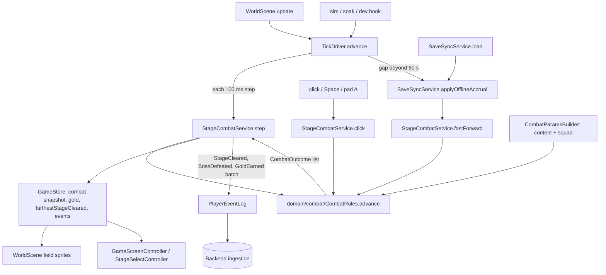

# Stage Combat Design

**Spec**: `.specs/features/stage-combat/spec.md`
**Status**: Draft

---

## Architecture Overview

One pure combat function in `domain/combat/` decides everything that happens on the field. It is
**segment-based**: between two events (spawn, kill, knock-out, click, timer end) every rate is constant,
so HP after `k` steps is computed as `hpAtSegmentStart − k × perStep`, never accumulated. One 100 ms
step and a `k`-step jump therefore produce bit-identical results (AD-007). The same function serves:

- the online loop (`TickDriver` → `StageCombatService.step`, one step at a time),
- gaps beyond the 60 s catch-up cap and offline time (`StageCombatService.fastForward`, jumping event to event in farming mode),
- the sim, the soak and the FR-11 tuning check (`npm run sim`, `tests/sim`),
- the gold/second rate shown in the HUD and later bounded by the backend (economy-tuning).

Services only translate results into state, events and notices; presentation only reads the snapshot.



### Step semantics (fixed order, one 100 ms step)

1. Empty Active Squad → phase `idle`, nothing happens.
2. `spawning`: decrement the spawn counter; at 0 spawn the next foe (normal monster `monsterIndex`, or the boss) and start a segment.
3. `fighting`: the foe takes `squadDpsVsFoe × 0.1`; if this kills it, the foe deals **no** damage this step (the squad strikes first).
4. Otherwise each living hero takes its share of `foeDps × 0.1 × (1 − def/(def+K))`. Normal foe: split evenly over living heroes. Boss: same, or all to the leader when no squad hero has the stage's favored type (AD-004).
5. Resolve in this order: kill → hero knock-outs → boss leader knock-out (failure) → boss timer decrement → timer at 0 (failure) → all heroes down on a normal stage (restart the stage).
6. A kill on a normal stage awards the stage's gold per kill; the 10th kill clears the stage, and the next stage starts with auto-advance on (otherwise the same stage restarts). Every stage start restores full HP.

`squadDpsVsFoe = Σ living heroes (power × dpsPerPower × (type === stage.favoredType ? typeBonus : 1))`.
A click deals `clickDpsShare × squadDpsVsFoe` at once and opens a new segment.

### Fast-forward (gap and offline)

`fastForward(snapshot, ms)` runs `advance` in **farming mode**: no boss victory, no stage advance, no
first-clear events (spec P2 AC 3). The farming stage is the current stage if it is normal, otherwise the
stage before the boss. Inside it the loop jumps straight to the next event (`ceil` to the step where the
predicate `hp0 − k × d ≤ 0` first holds, checked with the same expression the single step uses), so 12 h
costs O(events), not 432 000 steps. When the gap ends the snapshot resumes at the farming stage
mid-cycle; a boss fight interrupted by a gap restarts with a full timer when the player selects
"Fight boss" (or at once with auto-advance on).

---

## Code Reuse Analysis

### Existing Components to Leverage

| Component | Location | How to Use |
| --- | --- | --- |
| `StageOutcomeClassifier.classify` | `src/domain/StageOutcomeClassifier.ts` | Labels a boss failure (FR-11 rules unchanged); `Success` is never shown for a failure |
| `RosterRules.squadPower` | `src/domain/RosterRules.ts` | Squad power for the FR-11 label and the power floor comparison |
| `RosterService.activeSquadOf` | `src/services/roster/RosterService.ts` | Squad order (slot 1 = leader) for `CombatParamsBuilder` |
| `withEvent` / `withGold` | `src/services/core.ts` | `StageCleared`, `BossDefeated`; `withGold` stays for spends only |
| `OfflineAccrualCalculator` | `src/domain/OfflineAccrualCalculator.ts` | Keeps elapsed/credited/cap math; its gold term is replaced by `fastForward` gold |
| `TickDriver` | `src/services/tick/TickDriver.ts` | Unchanged loop; `step` calls `StageCombatService.step`; the sync-interval tick also flushes income |
| Save migrations | `src/services/save/migrations.ts` | Step v1 → v2 adds `local.combat` |
| Content loader + zod schemas | `src/services/content/` | New fields and the `economy/combat.json` kind; cross-checks in `validate:content` |
| Aseprite field sprite (Krell) | `src/presentation/scenes/WorldScene.ts` | Generalized: any hero with an `animations` entry uses it; others use the portrait fallback |
| `PlayerProgress.ApplyStageCleared` order rule | `Backend/src/InfinityGrove.Backend.Domain/Progress/PlayerProgress.cs:92` | Same rule shape for `ApplyBossDefeated` |
| VectorGen families `event-payloads`, `event-validation` | `shared/test-vectors/` | Extended with `BossDefeated` |

### Integration Points

| System | Integration Method |
| --- | --- |
| Event log / sync | New `BossDefeated { stageNumber }`; kill gold batched into one `GoldEarned` per sync interval |
| Backend ingestion | `PlayerEventType.BossDefeated = 5`; accepted only for stage ≤ furthest + 1; `StageCleared` of a boss stage requires an accepted `BossDefeated` for it |
| Backend hero catalog | Seed a Krell `HeroDefinition` (GUID) so Krell can be a regular, syncable hero |
| OpenAPI / `gen:api` | Re-export after the enum change; `gen:check` keeps the client in step |
| Save file | `formatVersion` 2: `local.combat { stageNumber, autoAdvance }`; the encounter itself is not saved (a reload restarts the current stage) |
| Boss-drops / boss-potions / season-cave | Consume `CombatOutcome` (`bossDefeated`) and reuse `CombatRules` with a cave stage source |

---

## Components

### CombatRules (domain)

- **Purpose**: The pure, segment-based field simulation.
- **Location**: `src/domain/combat/CombatRules.ts`
- **Interfaces**:
  - `advance(enc: Encounter, steps: number, p: CombatParams, mode: 'live' | 'farming'): { enc: Encounter; outcomes: CombatOutcome[] }` - runs `steps` steps, jumping event to event
  - `click(enc: Encounter, p: CombatParams): { enc: Encounter; outcomes: CombatOutcome[] }` - instant `clickDpsShare` hit
  - `startStage(stage: StageSpec, p: CombatParams): Encounter` - full HP, spawn counter, boss timer
  - `squadDpsVsFoe(enc: Encounter, p: CombatParams): number`
  - `damageTakenFactor(defense: number, k: number): number` - `1 − def/(def+K)`
- **Dependencies**: domain types only.
- **Reuses**: nothing; replaces `MonsterEntity.takeDamage` and `DamageCalculator` for combat (both retired with PORT_MAP notes).

### FarmRate (domain)

- **Purpose**: Gold per second of a farming stage for a squad, by running one stage cycle through `advance`.
- **Location**: `src/domain/combat/FarmRate.ts`
- **Interfaces**: `farmRate(stage: StageSpec, p: CombatParams): { goldPerCycle: number; cycleMs: number; goldPerSecond: number }`
- **Dependencies**: `CombatRules`.
- **Reuses**: `CombatRules.advance` in farming mode (one source of truth for the HUD and economy-tuning).

### BossFailureLabel (domain)

- **Purpose**: FR-11 label of a failed boss fight.
- **Location**: `src/domain/combat/BossFailureLabel.ts`
- **Interfaces**: `label(squadPower: number, powerFloor: number, favoredType: HeroType, squadTypes: readonly HeroType[]): 'PowerGate' | 'CompositionMismatch'` - maps the classifier's `Success` to `PowerGate`
- **Dependencies**: `StageOutcomeClassifier`.
- **Reuses**: `StageOutcomeClassifier.classify`.

### StageCurves (domain)

- **Purpose**: Numbers of stage `n` from the economy content (placeholder geometric curves; economy-tuning replaces them with bands).
- **Location**: `src/domain/combat/StageCurves.ts`
- **Interfaces**: `stageSpec(stage: StageData, eco: CombatEconomy): StageSpec` - monster HP, gold per kill, monster DPS, boss HP/DPS/timer
- **Dependencies**: content types.
- **Reuses**: none.

### CombatParamsBuilder (services)

- **Purpose**: Builds `CombatParams` (field heroes, stage spec, economy constants) from content and state.
- **Location**: `src/services/combat/CombatParamsBuilder.ts`
- **Interfaces**: `build(s: GameState, stageNumber: number): CombatParams`
- **Dependencies**: `ContentCatalog`, `RosterService.activeSquadOf`, `RosterRules`.
- **Reuses**: roster helpers; equipment power joins here later (equipment-enchant, AD-003).

### StageCombatService (services)

- **Purpose**: The commands of the field: step, click, jump, fight boss, auto-advance, fast-forward, income flush.
- **Location**: `src/services/combat/StageCombatService.ts` (replaces the walk/click loop of `CombatService`; the gold wallet `trySpendGold`/`addGold` moves here)
- **Interfaces**:
  - `step(dtMs: number): void`
  - `click(): void`
  - `jumpToStage(stageNumber: number): boolean` - cleared stages and furthest + 1 only; turns auto-advance off
  - `fightBoss(): void` - restarts the boss of furthest + 1 at full HP and timer
  - `setAutoAdvance(on: boolean): void`
  - `fastForward(ms: number): { gold: number; kills: number }` - farming mode, used by offline accrual and gap catch-up
  - `flushIncome(): void` - appends one `GoldEarned` for gold earned since the last flush
  - `trySpendGold(amount: number): boolean` / `addGold(amount: number): void` - spend flushes income first, so the backend sees the earn before the spend
- **Dependencies**: `ServiceDeps`, `CombatParamsBuilder`, `CombatRules`, `BossFailureLabel`.
- **Reuses**: `withEvent`, `withGold`.
- **Outcome handling**: `kill` → gold to state + `pendingIncome`; `stageCleared(n)` first time → `furthestStageCleared` + `StageCleared`; `bossDefeated(n)` → `BossDefeated` then `StageCleared`; `bossFailed` → `lastBossResult` label, back to the previous stage, auto-advance off.

### StageService (services, reduced)

- **Purpose**: Stage list for Stage Select: cleared stages plus furthest + 1, with type and, for bosses, power floor and predicted label.
- **Location**: `src/services/stages/StageService.ts`
- **Interfaces**: `selectableStages(): StageEntry[]`, `getPreview(stageId)` (kept for the boss risk line); `attemptStage` removed.
- **Reuses**: existing preview code.

### TickDriver / SaveSyncService (services, changed)

- `TickDriver.step` calls `stageCombat.step`; on each sync interval it calls `stageCombat.flushIncome()` before `syncNow()`.
- `SaveSyncService.applyOfflineAccrual` keeps the cap math from `OfflineAccrualCalculator` and credits `stageCombat.fastForward(elapsedCreditedMs).gold`; the notice text stays.
- `RosterService` rejects squad changes while a boss fight runs ("Squad changes are locked during a boss fight."); a leader that disappears anyway (e.g. a backend correction) fails the fight.

### WorldScene field (presentation)

- **Purpose**: Draw up to five field heroes, the foe, hero HP bars, the boss HP bar and timer.
- **Location**: `src/presentation/scenes/WorldScene.ts` + `src/presentation/scenes/FieldHeroView.ts`
- **Interfaces**: `FieldHeroView.create(scene, hero, animation | null)`, `sync(state)`; attacks play when `floor(enc.elapsedMs / attackIntervalMs)` grows for a living hero (AC 5); Aseprite tags `idle`/`attack` when the hero has an `animations` entry, otherwise the portrait image with a 120 ms forward tween (AC 6).
- **Dependencies**: `ReadonlyStore`, `Assets`, theme tokens.
- **Reuses**: Krell sprite creation, `hitFlash`, slime drawing (fallback foe body).

### Game and Stage Select controllers (presentation)

- `GameScreenController`: HUD `game.stage` (current), `game.progress` ("Monster 4/10" or boss timer), `game.goldRate`, `game.auto` toggle, `game.fightBoss` (after a failure), `game.result` (FR-11 label with the Unity wording), `game.field.<heroId>` nodes (HP, alive), `game.combat` (click target), empty-squad and "More stages coming soon" texts.
- `StageSelectController`: one row per selectable stage, `Go` button → `jumpToStage`; boss rows show favored type, power floor vs squad power and the predicted label.

### Backend

- `PlayerEventType.BossDefeated = 5`, `BossDefeatedPayload(int StageNumber)`, `PlayerProgress.ApplyBossDefeated` (order rule, records the highest boss defeated), `ApplyStageCleared` rejects a boss stage without its `BossDefeated` ("Cannot clear boss stage <n> before defeating its boss."). Boss stage = `stageNumber % BossEvery == 0`, with `BossEvery` from backend config, kept equal to content by a `stage-rules` vector family.
- Krell `HeroDefinition` seed migration.

---

## Data Models

### Content

```typescript
/** content/economy/combat.json (new kind; economy-tuning later turns flat curves into bands). */
interface CombatEconomy {
  monstersPerStage: number;        // 10
  bossEvery: number;               // 5
  spawnDelayMs: number;            // 300, multiple of 100, ≤ 500
  defaultBossTimerSeconds: number; // 30
  typeBonus: number;               // 1.5
  clickDpsShare: number;           // 0.05
  dpsPerPower: number;
  defenseK: number;                // damage taken × (1 − def / (def + K))
  monster: { hpBase: number; hpGrowth: number; goldBase: number; goldGrowth: number; dpsBase: number; dpsGrowth: number };
  boss: { hpMultiplier: number; dpsMultiplier: number; goldMultiplier: number };
}

interface StageData {            // changed
  stageId: string;
  stageNumber: number;           // contiguous from 1
  displayName: string;
  favoredType: HeroType;         // now applies to every stage (type bonus)
  monsters: string[];            // monster ids drawn in order (visual identity only)
  boss?: { monsterId: string; powerFloor: number; timerSeconds?: number }; // present iff stageNumber % bossEvery === 0; timer ≤ 60
}

interface MonsterData { monsterId: string; monsterName: string; sprite: string } // maxHp/goldMin/goldMax move to curves

interface HeroData {             // added fields
  baseHp: number;
  baseDefense: number;
  attackIntervalMs: number;      // animation pacing only
}
```

`GameSettings` drops `idleGoldPerSquadPowerPerHour`, `monsterPool` and `playerStats`; `offlineAccrualCapHours` stays.
`validate:content` adds: boss presence rule, timer ≤ 60 s (names file and `boss.timerSeconds`), monster/boss ids exist, `spawnDelayMs` multiple of 100 and ≤ 500, contiguous stage numbers.

### Runtime

```typescript
interface FieldHero {
  heroId: string; heroType: HeroType; slot: number;   // slot 0 = leader
  maxHp: number; hp: number; hpAtSegmentStart: number;
  dps: number; defense: number; attackIntervalMs: number;
  alive: boolean;
}

interface Foe { monsterId: string; isBoss: boolean; maxHp: number; hp: number; hpAtSegmentStart: number; dps: number }

interface Encounter {
  stageNumber: number;
  phase: 'idle' | 'spawning' | 'fighting';
  monsterIndex: number;          // 0..monstersPerStage-1
  foe: Foe | null;
  heroes: readonly FieldHero[];
  segmentSteps: number;          // steps since the last event
  spawnStepsLeft: number;
  bossStepsLeft: number | null;
  elapsedMs: number;             // drives animation cadence
}

type CombatOutcome =
  | { kind: 'kill'; gold: number }
  | { kind: 'stageCleared'; stageNumber: number }
  | { kind: 'bossDefeated'; stageNumber: number }
  | { kind: 'bossFailed'; stageNumber: number; cause: 'timer' | 'leader' }
  | { kind: 'squadWiped'; stageNumber: number };

/** GameState.combat (replaces CombatSnapshot; lastStageAttempt becomes lastBossResult). */
interface StageCombatSnapshot {
  encounter: Encounter;
  autoAdvance: boolean;
  kills: number;
  clicks: number;                // views play the click hit on change
  pendingIncome: number;         // gold earned since the last GoldEarned flush
  lastBossResult: { stageNumber: number; outcome: 'Success' | 'PowerGate' | 'CompositionMismatch' } | null;
}
```

**Relationships**: `Encounter.stageNumber ≤ furthestStageCleared + 1` always (clamped after a backend correction). Persisted: only `stageNumber` and `autoAdvance` (`SaveGameData.local.combat`).

---

## Error Handling Strategy

| Error Scenario | Handling | User Impact |
| --- | --- | --- |
| Empty Active Squad | Phase `idle`; no spawn, no damage | "Add a hero to your Active Squad to fight" |
| Last stage in content reached | Stays on it, farming; no advance | "More stages coming soon" |
| Boss timer > 60 s or missing boss on a boss stage | `validate:content` error naming file and field; the build fails | None (caught in CI) |
| Backend rejects `BossDefeated`/`StageCleared` | Existing reconciliation: canonical `furthestStageCleared` wins; encounter clamped to furthest + 1 | Correction notice (existing) |
| Squad change during a boss fight | `RosterService` refuses with a reason | Reason shown on the Roster |
| Leader removed mid-boss anyway (correction) | Fight fails with the FR-11 label | Failure label as usual |
| Save from v1 | Migration adds `local.combat { stageNumber: furthest + 1 capped to content, autoAdvance: true }` | None |

---

## Risks & Concerns

| Concern | Location (file:line) | Impact | Mitigation |
| --- | --- | --- | --- |
| Gold is an int32 clamped at 2 147 483 647 | `Client/src/services/core.ts:43` | Geometric gold curves overflow long before stage 300 | Placeholder curves stay small here; economy-tuning moves gold to `BigDouble` (log it in its design) |
| Monster HP and squad power truncate to int32 (`\| 0`) | `Client/src/domain/MonsterEntity.ts:27`, `Client/src/domain/RosterRules.ts:14` | Damage and HP overflow or lose fractions | `CombatRules` uses doubles; `MonsterEntity` combat use is retired; `squadPower` overflow tracked for economy-tuning |
| One `GoldEarned` event per gold change | `Client/src/services/core.ts:48` | Continuous kills flood the event log (RNFR-3 unsynced-log bound) | `pendingIncome` + `flushIncome` per sync interval and before spends; soak checks the bound |
| Krell hard-coded as the field character | `Client/src/presentation/scenes/WorldScene.ts:68`, `:171` | Squad heroes cannot appear | `FieldHeroView` per squad hero; Krell's weapon variant applies to the Krell hero |
| Krell has no backend hero definition | `Backend/src` (no match) | Krell as a regular hero would not sync | Backend seed migration with a fixed GUID, plus `content/heroes/krell.json` |
| Offline gold formula and its vector family come from Unity | `Client/src/services/sync/SaveSyncService.ts:80`, `shared/test-vectors/offline-accrual.json` | The new rate breaks the Unity vector family | Keep the cap/hours vectors; retire the gold term with a PORT_MAP amendment; the new catch-up equivalence test is a TS sim test (B6 closed) |
| Old combat flows in scenarios and tests | `Client/scenarios/p02-combat-loop.json`, `p03-equipment-bonus.json`, `p09-stage-select.json`, `p10-offline-accrual.json`, `Client/tests/e2e/menu-and-combat.spec.ts`, `Client/tests/unit/services.test.ts` | `npm run verify` breaks mid-feature | Each task that retires a flow rewrites its scenario/test in the same commit; fixtures regenerated by `fixtures:gen` |
| `lastStageAttempt` consumers | `Client/src/presentation/screens/StageSelectController.ts:43`, `Client/src/services/state/projection.ts:26` | Dead state after `attemptStage` goes away | Replaced by `combat.lastBossResult` in the same task |
| Floating-point boundary of the kill step | `CombatRules` (new) | A step-vs-jump mismatch would break exact catch-up equivalence | Both paths evaluate the same predicate `hp0 − k × d ≤ 0`; the jump adjusts `ceil` by ±1 against it; unit test compares 1-step × N with N-jump over random seeds |
| Backend cannot verify the boss fight itself | Backend ingestion | A modified client can claim `BossDefeated` | Order rule now; plausibility bound (squad power ≥ floor, gold rate) belongs to economy-tuning under AD-001 |

---

## Tech Decisions

| Decision | Choice | Rationale |
| --- | --- | --- |
| Damage model | Continuous DPS per 100 ms step; attacks are animation only | Developer choice (model B); exact catch-up and a computable rate |
| Exactness of step vs jump | Segment form `hp0 − k × d` instead of accumulation | Bit-identical results for any step grouping (AD-007) |
| Strike order | Squad strikes first; a killed foe deals no damage that step | Removes ties; matches "kill wins" intuition |
| Income events | One `GoldEarned` per sync interval (and before spends) | Bounded event log; the backend still sees every earn before every spend |
| Encounter persistence | Not saved; reload restarts the current stage | Saves stay small; losing up to one stage of progress is invisible next to offline accrual |
| Boss stage rule on the backend | `stageNumber % BossEvery == 0`, shared by a vector family | The backend does not read client content |
| Animation cadence | Derived from `elapsedMs / attackIntervalMs` in the view | No animation state in the domain; deterministic in e2e with the manual clock |
